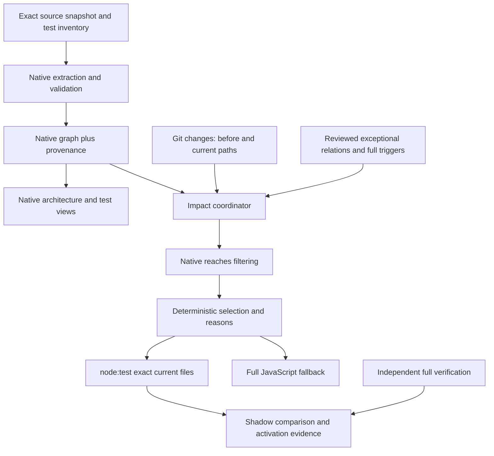

# Markdown Quality: dependency graph and affected JavaScript tests

Date: 2026-10-10. Status: **reviewable draft; implementation and configuration changes are not approved**.

Prepared using the installed HISEW planning method. The user requested dependency-cruiser adoption planning, architectural use of its graph, affected-test selection, and an assessment of Jest. This document records a proposed implementation, not a claim that the tool has been installed or the selector proved.

## Recommendation and intended outcome

Adopt **dependency-cruiser 18.5.0 as a development dependency**, retain **node:test**, and use dependency-cruiser's supported graph extraction, reverse reachability, validation, and reporters. Add only the repository-specific integration needed to identify changes, account for dependencies that are not JavaScript imports, select test files, invoke Node, and explain the result.

Give maintainers two outcomes: a reproducible view of dependencies, and faster feedback where a change affects a smaller set of tests. Optimize whole test files first. Measure total elapsed time including graph generation; shared imports may still require nearly all tests. Do not promise a percentage saving.

Keep the complete JavaScript suite and `check:full` as independent verification paths. Retain full hosted package qualification and its authenticated proof-reuse policy. Test selection must never narrow the Markdown documents or link targets checked by the product.

Deliver graph generation and selection inspection before allowing omitted execution. Promote local affected execution only after adversarial fixtures, seeded regressions, and shadow comparisons pass. Required-CI narrowing and Jest migration are separate future decisions.

## 1. Authority, HISEW state, and baseline

### Accepted intent and draft decisions

The accepted intent is to produce this plan. The selected tool and desired capabilities are accepted planning inputs. The REQ, AC, QA, DEC, configuration proposals, risk route, and slices below are **draft representations awaiting owner acceptance**. They are not an accepted requirement snapshot or permission to implement.

Authorized now: read-only research, repository inspection, HISEW inspection, a reversible session target selection, and saving this document in Downloads. No dependencies were installed and no repository source, configuration, lockfile, CI, or Git history was changed. No tests, qualification, scans, commits, pushes, deployments, or publication were performed for this plan.

HISEW applicability for `C:\Users\maksy\GitHub\markdown-quality` returned `personal`, `active: true`; workflow status returned `ready`.

| Identity | Inspected value |
| --- | --- |
| Project | `72c306af-f445-4135-b463-c0829d3204d4` |
| Worktree | `6701ef39-aac1-4423-b30a-3fa13ac21cc8` |
| Installed method | `0.1.0-dev.18` |
| Configuration root | `C:\Users\maksy\.hi\w\c` |
| Evidence root | `C:\Users\maksy\.hi\w\e` |

The inherited session initially selected another repository. Native `select-repository` bound the session to the explicitly requested worktree, generation 2. It did not register, reactivate, configure, or adopt an execution. Capability inspection then succeeded. `inspect-workflow-progress` reported an existing `handoff-committed` state and said a new execution requires its own accepted scope. That retained work was not adopted or modified.

Native profile inspection found `focused`, `affected`, and `full`, invoking their npm scripts without arguments. It reported `risk-route-not-selected` and classified coverage declarations as claims, not verified coverage. No new native risk route, snapshot, execution, or implementation handoff is claimed. Resolve providers natively when an independent verification/security operation is actually authorized; availability grants no authority.

The planning skill requires accepted/draft requirements, route, invariants, design, and verification knowledge. This draft supplies the proposed dossier and identifies missing acceptance. Before implementation, the owner accepts the applicable revision and exact configuration proposal; the lifecycle owner then captures the accepted basis and starts a new scoped HISEW execution.

A single explicit acceptance may authorize the specified implementation, exact configuration edits and activation conditional on the stated evidence. Record that scope once and proceed through accepted slices when their conditions are met, without repeated phase prompts. Reviewing this document alone is not implementation authority; new effects, changed configuration or a failed safety condition still require the corresponding decision.

Method sources: [planning skill](/C:/Users/maksy/.codex/plugins/cache/hadden-industries/hisew/0.1.0-dev.18/skills/hadden-industries-plan-software-change/SKILL.md), [engine invocation](/C:/Users/maksy/.codex/plugins/cache/hadden-industries/hisew/0.1.0-dev.18/method/engine-invocation.md), [engineering principles](/C:/Users/maksy/.codex/plugins/cache/hadden-industries/hisew/0.1.0-dev.18/method/engineering-principles.md), [risk routes](/C:/Users/maksy/.codex/plugins/cache/hadden-industries/hisew/0.1.0-dev.18/method/risk-routes.md), and [workflow progression](/C:/Users/maksy/.codex/plugins/cache/hadden-industries/hisew/0.1.0-dev.18/method/workflow-progression.md).

### Source baseline

| Observation | Inspected value |
| --- | --- |
| Checkout | `C:\Users\maksy\GitHub\markdown-quality` |
| Branch / HEAD | `main` / `12768981722c5c85e11f9090e7aafbdf8fa404fb` |
| Latest subject | `ci: Install stable Python 3.15 with pinned uv` |
| Working tree | Clean at inspection and pre-draft recheck |
| Local and remote main | `origin/main` and read-only `git ls-remote origin refs/heads/main` both matched HEAD |
| Package | `@hadden-industries/markdown-quality`, source version `1.0.3`, native ESM, AGPL-3.0-only |
| Inventory | 33 top-level source JS modules; 39 top-level `test/*.test.js` files; 4 top-level Python test files |
| Node engines | `^22.23.3 \|\| ^24.21.0 \|\| >=26.10.0` |
| Qualification | Windows x64 and Ubuntu 24.04 x64; declared minima and current stable patches of Node 22/24/26 |

Recheck identities, uncommitted changes, runtime policy, tooling, and remote state before implementation; preserve later user/concurrent changes. No repository-local or applicable ancestor `AGENTS.md` was found in the inspected inventory. This task's explicit configuration and working-tree boundaries still apply. The checkout has no `docs/development.md`; use [CONTRIBUTING.md](/C:/Users/maksy/GitHub/markdown-quality/CONTRIBUTING.md), [support policy](/C:/Users/maksy/GitHub/markdown-quality/docs/support-and-release.md), and [CI trust](/C:/Users/maksy/GitHub/markdown-quality/docs/ci-trust.md).

Historical notes identified product/publication boundaries, but live source takes precedence: current root configuration uses schema 2, results use schema 3, and `authored-gfm@1` remains the preset. Do not restore historical schema defaults. Immutable published 1.0.3 and current unreleased source have different support/behavior claims.

## 2. Current architecture and verification boundary

| Surface | Current evidence | Selection consequence |
| --- | --- | --- |
| Public orchestration | [src/quality.js](/C:/Users/maksy/GitHub/markdown-quality/src/quality.js) imports configuration, documents, analysis, native tooling and workers, and re-exports execution, qualification, migration and staging | A file-level graph will connect many tests through this shared module. Do not split the API just to improve selection statistics. |
| Native ESM tests | [test/quality.test.js](/C:/Users/maksy/GitHub/markdown-quality/test/quality.test.js), [test/replacement.test.js](/C:/Users/maksy/GitHub/markdown-quality/test/replacement.test.js) and other tests use `node:test` and `node:assert/strict` | Preserve real Node execution, assertions, hooks, cleanup and process behavior. |
| Worker entry point | [src/document-analysis.js](/C:/Users/maksy/GitHub/markdown-quality/src/document-analysis.js) constructs `new Worker(new URL('./document-worker.js', import.meta.url))` | Worker URLs need an incoming relation even if the import graph lacks one. |
| Spawned JavaScript | [src/execution.js](/C:/Users/maksy/GitHub/markdown-quality/src/execution.js) starts `execution-worker.js`; [test/cli.test.js](/C:/Users/maksy/GitHub/markdown-quality/test/cli.test.js) starts the CLI by path | Process-entry relationships are not ordinary imports. |
| Filesystem JSON | [configuration.js](/C:/Users/maksy/GitHub/markdown-quality/src/configuration.js), [result-validation.js](/C:/Users/maksy/GitHub/markdown-quality/src/result-validation.js), and [contracts.js](/C:/Users/maksy/GitHub/markdown-quality/src/contracts.js) read schemas or package metadata | Imported-JSON support does not establish filesystem-read coverage. |
| Native execution | [native-tool.js](/C:/Users/maksy/GitHub/markdown-quality/src/native-tool.js), tool manifests, TOML and platform packages | JS analysis cannot prove native build, rights, binary or runtime-asset dependencies. |
| Packed/installed trees | [scripts/pack.js](/C:/Users/maksy/GitHub/markdown-quality/scripts/pack.js), [packaging.test.js](/C:/Users/maksy/GitHub/markdown-quality/test/packaging.test.js), Python archive helpers | Source imports do not model generated manifests and installed consumers completely. |
| Generated test programs | [resource-limits.test.js](/C:/Users/maksy/GitHub/markdown-quality/test/resource-limits.test.js) writes ESM programs with interpolated imports and invokes them | Embedded program dependencies need explicit coverage or full fallback. |
| Shared controls | Workflow tests read YAML; node-support tests inspect every locked engine; source policy inspects Git attributes | Configuration changes cannot accidentally yield zero tests. |
| Python/performance | Python tests and JS wrappers invoke observers/qualification scripts | This phase selects JS test files. Python and performance proof remain separate. |

This is a starting inventory. SLICE-002 completes and independently checks every relevant non-import relation before subset execution is enabled.

| Current command | Current behavior | Proposed treatment |
| --- | --- | --- |
| `npm test` | `node --test test/*.test.js` | Preserve independent full JavaScript execution. |
| `npm run check:focused` | Only `test/contracts.test.js` | Preserve meaning. Run new selector contract tests explicitly; this profile alone cannot prove them. |
| `npm run check:affected` | All `test/*.test.js` | Proposed activation point; inadequate context still runs all JS tests. |
| `npm run check:full` | `node scripts/verify.js` | Retain full discovery and every existing obligation. |
| `npm run check:markdown` | Source CLI over full configured Git inventory | Preserve product document/link scope. |
| Formatting commands | `format:code` and `format:markdown` write files | Use only during authorized implementation; inspect scope and settle inputs before expensive proof. |

[scripts/verify.js](/C:/Users/maksy/GitHub/markdown-quality/scripts/verify.js) verifies license/native identity, requires stable Python >=3.15, runs native/archive/text Python evidence, checks JS syntax, runs Prettier, discovers all top-level JS tests, and checks the full Git Markdown inventory. It currently invokes bare `python`. Do not execute it during planning or expand this task into repairing Python plumbing. Later local Python execution must use the existing `.venv` through the authorized environment; an unavailable prerequisite remains a proof gap.

[check.yml](/C:/Users/maksy/GitHub/markdown-quality/.github/workflows/check.yml) runs `check:full` in package lanes. Its `matrix`, `probe`, `strategy`, `package`, and `required` jobs form a closed reuse contract enforced by [ci-reuse.js](/C:/Users/maksy/GitHub/markdown-quality/scripts/ci-reuse.js) and workflow tests. A changed/new job, narrowed lane, or altered receipt is a separate policy proposal.

## 3. Software selection and native reuse

Research was refreshed on 2026-10-10 using registry metadata, tagged maintainer source and official docs. No package was installed or executed for this assessment.

### Version, runtime and rights

Registry `latest` and the maintainer release agreed on **dependency-cruiser 18.5.0**, published 2026-09-30. Its Node range `^22||^24||>=26` admits the repository's minima. Its `watskeburt@6.0.0` dependency declares `^22.13||^24||>=26`, also compatible with those minima. Full locked-transitive engine validation and observed Windows/Linux behavior remain implementation obligations. [Registry metadata](https://registry.npmjs.org/dependency-cruiser/18.5.0), [release](https://github.com/sverweij/dependency-cruiser/releases/tag/v18.5.0), [tagged manifest](https://github.com/sverweij/dependency-cruiser/blob/v18.5.0/package.json), [watskeburt metadata](https://registry.npmjs.org/watskeburt/6.0.0).

The registry archive integrity was `sha512-LFvJOvufjQ7XTucSI40NHqse0gcQBevDGkZabLAKcGwO+VWOywTqZ5EyFRYWSokNxvLOO7v6EXyNi+9I72oWUA==`. Resolve and retain native lock identities after approval; this recorded string is not package-manager verification.

The exact tagged license is MIT, copyright Sander Verweij, with notice retention. Markdown Quality remains AGPL-3.0-only. Use is development analysis, not a runtime dependency. Direct license inspection is complete; **actual organizational clearance, transitive rights/security review and notice treatment are pending**. Do not infer approval from SPDX alone. The current packer removes scripts but copies other manifest metadata, so prove that developer tool code and consumer runtime dependencies do not leak into archives; development metadata may remain visible in a packed manifest. [Exact license](https://github.com/sverweij/dependency-cruiser/blob/v18.5.0/LICENSE).

### Capability fit

| Need | Native/reused capability | Exact residual gap |
| --- | --- | --- |
| Import/export discovery and resolution | dependency-cruiser | Complete authored JS/MJS/CJS inventory and deliberate resolver options |
| Reverse transitive dependants | Native `reaches` through public `format()` or CLI | Safe exact-path seeds, union with current test inventory; no custom JS graph walk |
| Git-based exploration | Native `--affected <revision>` | Explicit immutable base and safety policy for changes outside its supported graph |
| Architecture views | Native JSON, Mermaid, DOT, metrics and rule reporters | Readable projections and provenance; no custom renderer or mandatory Graphviz |
| Upstream validation | Native configuration validation and public `format()` result validation | Local limits, snapshot binding and residual policy validation only |
| Worker/process/filesystem/generated/native boundaries | Import extraction is incomplete here | Small reviewed supplementary relation policy and full-trigger domains |
| Candidate/change identity | Git and native graph generation | Before/current topology, dirty contents, unknown inputs, full fallback |
| Selected execution | Node CLI with explicit paths | Shell-free process invocation, truthful outcome and cleanup |

In tagged source, `--affected` wraps reverse reachability using `watskeburt` with a fixed JS-family/JSON extension set. It is CLI-only; an API `affected` setting is ignored. Python, TOML, Markdown and arbitrary assets need another disposition. Use public `reaches` on captured graphs, with an explicit comparison context. [CLI](https://github.com/sverweij/dependency-cruiser/blob/v18.5.0/doc/cli.md), [normalization](https://github.com/sverweij/dependency-cruiser/blob/v18.5.0/src/cli/normalize-cli-options.mjs), [public options](https://github.com/sverweij/dependency-cruiser/blob/v18.5.0/types/options.d.mts).

Tagged ESM extraction handles declarations, literal import expressions and re-exports, not arbitrary Worker/new-URL, filesystem reads, spawned programs or generated strings. Public `format()` validates graph input and supports `reaches`, allowing one captured graph to feed selection and views. Never import private `src/graph-utl` internals. [ESM extraction](https://github.com/sverweij/dependency-cruiser/blob/v18.5.0/src/extract/acorn/extract-es6-deps.mjs), [API](https://github.com/sverweij/dependency-cruiser/blob/v18.5.0/doc/api.md), [format validation](https://github.com/sverweij/dependency-cruiser/blob/v18.5.0/src/main/format.mjs), [output contract](https://github.com/sverweij/dependency-cruiser/blob/v18.5.0/doc/output-format.md).

The sibling [WebVOWL architecture test](/C:/Users/maksy/GitHub/webvowl/src/productionModuleFormat.architecture.test.js) follows public `bin.depcruise`, invokes through `process.execPath`, and consumes JSON for repository assertions. Reuse that interface discipline and bounded subprocess pattern. Do not copy its large policy analyzer, historical CommonJS inventories or Jest setup. It currently supplies neither this selector nor routine graph publication.

### Alternatives

| Option | Assessment |
| --- | --- |
| Node's built-in runner | Retain. Exact file invocation fits. Watch mode tracks loaded test dependencies for live development, but is not a Git-diff/resource/native completeness mechanism. [Node 22.23.3 docs](https://nodejs.org/download/release/v22.23.3/docs/api/test.html). |
| Jest | Related-test features are useful, but not needed to consume dependency-cruiser's runner-independent output; see section 4. |
| Nx affected tasks | Useful maintained Git/project-graph orchestration, but this is test-file selection within one core package. Adoption adds a task/project model and still needs resource relations. Reconsider for a future multi-project workspace. [Nx guidance](https://nx.dev/docs/features/ci-features/affected). |
| Bespoke parser/resolver/traversal/UI | Reject: maintained capabilities cover these needs. Custom work is residual integration. |
| Coverage-only selection | Do not use as authority: observed execution may miss unexercised conditions and native/file inputs. It can later corroborate graph evidence. |

No Node/npm/Python/framework upgrade is required by the selected tool's direct engine range. Recheck latest stable before installation. A changed version requires refreshed approval and evidence, not silent substitution.

## 4. node:test versus Jest

**DEC-002 recommendation: retain node:test.** The 39 tests already exercise ESM, processes, workers, async cleanup, OS skips, native executables and installed packages. `test/helpers.js` accepts Node TestContext and uses `t.after`; `replacement.test.js` uses `t.mock.method` with `syncBuiltinESMExports`; other tests generate programs importing `node:test`. Migration changes execution contracts, not only test declarations.

Current Jest is 30.5.2, MIT, with direct engines `^18.14.0 || ^20.0.0 || ^22.0.0 || >=24.0.0`, admitting this repository's runtimes. It provides `--findRelatedTests`, `--onlyChanged`, `--changedSince` and listing; documented changed-test selection relies on a static graph. It does not remove this repository's non-import dependency problem. [Jest metadata](https://registry.npmjs.org/jest/30.5.2), [CLI](https://jestjs.io/docs/cli).

Official ESM guidance still calls support experimental, describes `--experimental-vm-modules` and ESM transform setup, and records loader differences from Node. This is a fidelity and qualification cost for a native Node CLI package, not a claim Jest cannot run it. [ESM guidance](https://jestjs.io/docs/ecmascript-modules).

| Dimension | Retain node:test | Migrate to Jest |
| --- | --- | --- |
| Selection | Native graph selects paths, Node executes them | Own graph or explicit paths; graph ownership must be deliberate |
| Existing contracts | Preserve TestContext, hooks, mocks and assertions | Migrate registrations, helper lifetimes, contexts, mocks and reporting; address spawned Node tests |
| ESM fidelity | Native product loader | Qualify Jest's module environment and VM launch on each runtime |
| Process/native behavior | Existing integrations retained | Prove workers, subprocesses, signals, cleanup and timeouts remain meaningful |
| Benefits | Existing stable runner and explicit file support | Ecosystem/matchers/watch/reporters; justify with a concrete unmet need |
| Dependency/config footprint | One analyzer and thin adapter | Additional runner graph, ESM/environment config, lock/reporting/coverage effects |
| Adoption cost | New graph/selector contracts | Review all 39 tests, helpers, generated programs, npm scripts, verifier and hosted assumptions; no reliable duration estimate without a pilot |

Do not add a permanent Jest-to-node:test bridge or dual runner to preserve incompatible contracts. That adds another boundary and potentially an NSH-01 shim requiring a scoped owner exception. Existing Node-version-specific mock code is a migration consideration, not permission to expand it here.

If the owner chooses Jest, DEC-010 is a separate change. A useful pilot covers a pure function, TestContext cleanup, built-in/ESM mocking, a worker, a CLI subprocess, and a packed consumer on Windows/Linux at supported minima. Compare discovered test identities, positive and deliberately failing outcomes, skips, cleanup, native output and elapsed time. Approve exact config/dependencies and rights/security disposition before execution. Measured benefits plus preserved proof are the migration gate; all-green output alone is insufficient.

## 5. Draft HISEW risk route

**Risk class:** Proposed R2 for adoption that changes which tests execute. Graph-only inspection is a bounded preparatory capability, not authority to downgrade the combined change.

**Decision owner:** Repository owner. Future integration agent owns implementation evidence; independent verifier owns the independent selection-safety assessment.

**Reasoning:** False-negative selection can hide defects and change workflow evidence. The graph crosses source/test/process/resource boundaries, and missed tests can delay detection. This is elevated workflow assurance risk despite no intended product API change.

**Potential blast radius:** Developer feedback, affected verification, graph artifacts, source installation and any later workflow consumer. Full hosted qualification limits initial release impact.

**Reversibility:** Full commands remain immediately available. Disabling selection does not prove previously skipped candidates; requalify them. Configuration recovery is an authorized targeted forward edit, not destructive Git restoration.

**Principal unknowns:** Non-import completeness, baseline graph fidelity, total cost/fan-out, locked transitive compatibility/rights, and native HISEW context delivery.

**Required artifacts:** Accepted dossier/configuration proposal, native execution/route when implementing, graph/selection evidence, independent fixtures, shadow/seed results, final proof and resource dispositions. No GitHub Issue or PR is implied by this plan.

**Required specialist lenses:** Independent selection/correctness verification; dependency/untrusted-input security review; rights/notice disposition. Use selected native providers when authorized; source inspection is not a live scan.

**Required verification:** Focused graph/selector proof; affected regressions; full relevant HISEW profile on a frozen candidate; hosted Windows/Linux qualification when delivery is authorized; packed-consumer proof for dependency effects. Transported, performance, release and consumer acceptance remain separate.

**Required human approvals:** Requirements/risk/design; exact dependency/config/lock/script changes; any blocking architecture-policy change; subset activation; later CI/HISEW policy changes; distinct commit/push/publication effects when requested. Actual rights/security disposition precedes adoption.

**Maximum sensible autonomy:** Complete this draft now. After acceptance, implement and verify approved slices, preserving unrelated work and completing already-authorized lifecycle effects. Additional configuration or weaker verification needs its exact proposal.

**Next lifecycle step:** Review this draft and configuration proposal, then capture the accepted baseline/route and start a new execution. Do not adopt the retained completed handoff.

## 6. Draft requirements, acceptance, and invariants

| IDs | Requirement and acceptance criterion |
| --- | --- |
| REQ-001 / AC-001 | Produce a useful architecture bundle from the complete declared authored inventory using dependency-cruiser. Native JSON validates; views identify modules/packages, static edges, cycle/rule findings and test relationships. Supplemental relations are labeled and every view binds the same graph/snapshot. |
| REQ-002 / AC-002 | Select the deterministic union of directly changed tests and transitive dependants of all changed inputs across modeled boundaries. Independent fixtures assert exact or explicitly permitted superset results, including multi-input and cyclic cases. |
| REQ-003 / AC-003 | Account conservatively for workers, processes, resources, schemas, fixtures, generated/native inputs and shared controls. Every known relation has a native/explicit/fallback disposition. Unknown coverage cannot silently mean zero tests. |
| REQ-004 / AC-004 | Bind selection to exact before/current identity, changes, tool/lock/config/policy and test inventory. Stale, partial, malformed, mismatched or out-of-root evidence causes visible full fallback or failure if full execution is unsafe/impossible. |
| REQ-005 / AC-005 | Preserve independent full JS/full-profile/hosted qualification, authenticated reuse, Markdown scope, CLI/API/schema/preset behavior, native provenance and licenses. Packaging proof confirms tooling remains outside product runtime. |
| REQ-006 / AC-006 | Report selected/total files, mode, baseline, changed paths, reasons, supplemental rules, fallback and actual execution outcomes. Skipped tests are never reported as passed. |
| REQ-007 / AC-007 | Reuse native extraction, resolution, reachability, reporters and validation; retain node:test. Custom code only owns change context, policy composition, artifact identity and invocation. |
| REQ-008 / AC-008 | Prove retained required failures with independent seeded regressions and shadow comparisons. Activation requires zero unexplained missed failing files in the reviewed corpus and measured complete cost. |
| REQ-009 / AC-009 | Prove Windows/Linux paths, processes, cancellation, finite resources and supported minimum Node runtimes. No shell injection, path escape, elevated candidate-config execution or product-file writes. |
| REQ-010 / AC-010 | Define owners, retention, activation/abort/recovery and cleanup. Interrupted/stale evidence cannot grant success; preserve required failures while disposing of owned scratch. |

Product invariants: AGPL-3.0-only bytes; current schema/public compatibility; `authored-gfm@1`; optional fence language; literal preservation; ordered results; guarded writes; serial default with existing opt-in concurrency; native identity; full configured Markdown/link checking. No document/referrer-mode feature is included.

No ontology imports are present in scope. Do not present this JavaScript graph as an ontology, native build, package provenance or complete behavioral coverage graph.

## 7. Proposed design and evidence contract

### 7.1 Boundaries and predicted seams

Predicted implementation seams:

- `scripts/dependency-graph.js`: bounded native extraction/formatting, architecture outputs and provenance.
- `scripts/affected-tests.js`: change-context validation, safety decisions, native reachability composition, exact test paths, reports and Node invocation.
- `.dependency-cruiser.json`: data-only native options and architecture rules.
- `.test-impact.json`: data-only supplemental relations and conservative triggers; this is test configuration requiring exact approval.
- `test/dependency-graph.test.js` and `test/affected-tests.test.js`: independent fixtures and real graph/runner boundary checks.
- `test/fixtures/dependency-impact/`: minimal relation/failure fixtures, if an existing fixture seam is insufficient.
- `docs/dependency-graph-and-tests.md`: operational and graph-interpretation contract.

These are predictions, not approved files. Keep all tool/selector imports in developer scripts/tests. No published `src` module may import dependency-cruiser or these scripts. Do not expand runtime dependencies or package exports. Do not split `quality.js`, alter assertions or refactor product modules just to shrink sets. If broad fan-out defeats the optimization, report that evidence and assess architecture changes separately on maintainability/correctness grounds.

### 7.2 Complete graph first; projections afterward

Cruise authored JS entry roots in `src`, `scripts`, and `test`, including `.mjs` scripts, helpers, CLI/worker roots and otherwise unreferenced modules. Derive the inventory so new files cannot disappear behind a fixed list. Dependency directories and generated/temporary outputs are not roots. Do not follow third-party internals by default, but retain external edges for coupling and runtime/dev-boundary checks.

Keep deliberately invalid negative-fixture programs as inert fixture data or materialize them inside owned temporary test trees. Any excluded literal-fixture domain must be explicit and mapped to its owning tests; it cannot hide runnable test files or product modules. An unexpected executable source under a fixture domain causes full fallback and review.

Do not use `maxDepth`, display collapse or an early include-only filter to reduce the selection graph. Filtering to tests before reachability would discard needed source paths. Apply view filters after capture; run native reverse reachability on the complete graph and only then intersect with independently enumerated current test files.

Produce a repository overview, runtime import view, tests-to-source view and a change-specific affected subgraph. Use native Mermaid initially. DOT can be emitted without installing Graphviz. Report native cycles/rules and, if useful, native coupling metrics. Metrics are descriptive; arbitrary thresholds do not become blocking policy. CLI/worker roots are legitimate, so do not enable a blanket orphan error.

Initial rule proposal: unresolved dependencies and runtime imports of tests/developer scripts/devDependencies are errors; cycles warn until the actual baseline is reviewed. Present exact predicates and severities in the configuration diff and prove positive/negative examples. Do not generate a blanket baseline to suppress unexplained violations.

### 7.3 Supplemental relations without another import engine

Retain native-discovered imports unchanged and authoritative. The supplemental policy contains only relations native extraction lacks, with dependency/consumer paths or bounded groups, relation kind, source evidence, intended consumer and validation fixture. Do not duplicate ordinary imports.

When a supplemental dependency changes or appears in the native affected set, activate its consumer module or exact test as another seed. Reuse public `format(..., {reaches: ...})` for closure. A small monotone coordinator may apply each supplemental rule at most once and repeat the native query until no new seeds remain, bounded by the finite rule inventory. This composes declared exceptional edges with native traversal; it must not walk JS import adjacency itself. Cycles/ambiguity/bounds/unsupported inputs that prevent a trustworthy result cause full fallback.

| Relation | Proposed treatment |
| --- | --- |
| `document-analysis.js` consumes `document-worker.js` | Declare the worker edge. A change in the worker's imported leaf must reach analyzer consumers, not just a direct worker edit. |
| `execution.js` consumes `execution-worker.js` | Declare spawned-program edge and propagate to public execution callers. |
| CLI tests spawn `src/cli.js` | Declare CLI-to-test edges, including changes in the CLI's imported closure. Inventory all subprocess tests. |
| Code reads JSON schemas | Precise schema-to-reader edges only when independently proved; schema changes remain full triggers until then. |
| `resource-limits.test.js` generates imports | Explicit tested-module-to-test relations from the generated program. Do not parse program strings as a new JS resolver. |
| Native manifests/binaries/TOML/build helpers | Full JS plus applicable full/native/packaged checks. No native build impact engine in this phase. |
| Test fixtures | Explicit fixture-to-consumer edges; unknown or ambiguous fixtures select all JS tests. |
| Manifest, lock, graph/impact config, runner/control files, CI or HISEW declarations | Full selection and applicable independent checks. A policy cannot justify its own narrowed validation. |

The architecture bundle includes a generated supplemental relation table and labels these edges as declared, not parsed. Native cycle metrics describe the import graph only. A combined diagram, if useful, must label provenance and use an existing renderer; synthesized edges must not be presented as native analyzer conclusions.

Every new/changed filesystem, worker, process, computed-load, generated-program or resource boundary needs a reviewed disposition. Import extraction cannot prove hidden dependencies absent. Existing parser/lint facilities may provide useful guards, but do not introduce a regex JS parser or claim a syntax check establishes semantic completeness. If confidence in maintaining the inventory is inadequate, keep full execution for that domain.

### 7.4 Exact change context and old/current topology

For committed comparisons, resolve an explicit base to an immutable commit and identify candidate commit/tree. For a working tree, include staged, unstaged and relevant untracked changes, content digests and current test inventory. Use native Git NUL-delimited output, preserving spaces, Unicode and punctuation. A supplied path list may add seeds; it cannot replace the complete authoritative changes used for verification.

Use both paths for renames/deletions. Safety must not depend on Git recognizing a rename: deletion plus addition is conservative. Added tests always select themselves. Removed tests are tombstones, trigger full discovery/review of lost coverage, and are never passed as nonexistent current runner paths.

Compute the union of relevant native reachability over **baseline and current graphs**, then intersect with surviving/current tests and include directly changed tests. Otherwise removed edges can erase the old dependency relation. A new path absent from baseline needs a current-graph/policy disposition; absent membership never proves no impact.

Baseline acquisition is a bounded implementation probe: prefer an artifact tied to the exact baseline and compatible tool/config/policy/lock. Otherwise use native Git to materialize an owned source-only snapshot, parse it without executing its code/configuration, and use supported dependency-cruiser resolver options against the same verified installed dependencies. Do not install into historical snapshots or assume current dependencies equal a different baseline lock. Incompatible lock/config, unsafe link/path, missing object, shallow clone, ambiguous base, or irreproducible resolution causes full fallback. Do not switch or create user worktrees just to obtain a baseline.

No implicit `main` or `HEAD~1` comparison is acceptable for verification. Native `--affected` is useful exploration with an explicit revision, but the coordinator owns complete change inventory and admission. HISEW currently passes no baseline argument to `check:affected`; until a supported exact context is supplied, its no-argument invocation remains full. The proposed npm entrypoint accepts `--base <commit>` for local selection. A future HISEW context integration must consume genuine execution metadata through a supported interface and receive exact configuration approval, not infer a task from the last commit.

### 7.5 Selection, explanation and fallback

Select the union of direct changed tests, old/current native dependants and supplemental consumers. Deduplicate/sort normalized repository-relative paths. Select complete files, preserving hooks/subtests and native semantics. Do not guess individual test names or infer coverage from an imported function name.

Each selected file records direct-change or native-seed reason and supplemental rule IDs. Retain the filtered native subgraph when a chain is needed. Do not build a shortest-path walker for decorative explanations. A full result records its trigger instead of inventing a dependency chain for every test.

Use `process.execPath` with an argument array and no shell. Reject out-of-root and option/path-injection input. Normalize display separators without blindly lowercasing Git paths. Case collisions, symlink/reparse escape, unsupported filename encoding, excessive path/regex/graph input, timeout, cancellation and partial output are safety cases. A selected-test failure remains a failure: never invoke a fallback to overwrite it with a green result.

| Condition | Required response |
| --- | --- |
| Missing trustworthy explicit comparison context | Full JS run and reason |
| Unknown file, incomplete relation/inventory, relevant unresolved edge, invalid graph/policy | Full JS if safe; retain the gap |
| Deleted/renamed path without usable old topology | Full JS |
| Manifest/lock/tool/config/control changes | Full JS plus independently applicable control/full checks |
| No changed paths | Default full run for verification; inspection can say no change/no execution |
| Nonempty change but zero selected tests | Full JS until a future exact no-test policy is approved |
| Snapshot changes during selection/execution | Invalidate evidence; stop or rerun on settled inputs, never claim exact-candidate pass |
| Missing Node/runner, corrupt test inventory, unsafe root or full run impossible | Nonzero incomplete/failure, no successful fallback |
| Selected tests fail | Preserve failure and diagnostics; shadow full result only supplements it |
| Analysis exceeds cost/resource bounds | Full JS with measured reason; investigate before caching or weakening completeness |

### 7.6 Identity, schema and data lifecycle

Keep raw native JSON intact. A separate versioned local report binds repository root, base/current commit/tree or dirty content manifest, changed paths/status, tool/runtime/platform, lock/config/policy digests, raw graph digest, current inventory digest, selected reasons, mode, fallback, and execution outcome. Local content hashes are not authenticated hosted provenance.

Determinism concerns selected files, reasons and semantic fields for the same input. Separate timestamps/timing from comparison fields. Use native validation for upstream graph/config; reuse existing Ajv for a small local persisted policy/report schema if needed. Do not copy the vendor's schema into a shadow validator.

Begin without a persistent cache. Reuse one captured graph for multiple views/queries in an invocation. Any later cache must bind source contents, before/current identity, lock, runtime/platform, tool, resolver options, graph/policy and inventory. A miss uses fresh extraction or full selection. Partial writes cannot look complete: write in an owned temporary location and finalize after all required parts succeed.

Resolve active HISEW evidence allocation before workflow scratch. Graph output uses an explicit external/owned output directory with owner and disposal trigger; no silent repository `.sdlc` or new ignore rules. Retain compact accepted proof and required failures; remove completed owned snapshots. Preserve this Downloads deliverable until the user disposes of it.

## 8. Exact configuration proposal for review

Every row is **proposed only**. Present the final exact diff before edits and confirm it remains minimal. Approval to implement a feature does not imply approval of additional configuration effects.

| File / setting | Smallest proposed change | Behavioral/pipeline impact | Gate |
| --- | --- | --- | --- |
| `package.json` / `devDependencies.dependency-cruiser` | Add exact assessed initial version `18.5.0` | Developer installation gains the analyzer graph. No runtime dependency/export/engine/native-version change. Exact pin is proposed because this manifest pins registry dependencies; a floating dev range is a separate explicit choice. | DEC-001 and rights/security disposition |
| `package-lock.json` | Regenerate using approved Node/npm with lifecycle scripts disabled, resolving that exact tool | Source and archive lock identities change. Inspect entire diff; no opportunistic runtime upgrades. Validate all added engine ranges. | Same exact dependency approval |
| `.dependency-cruiser.json` | New data-only config: complete roots via coordinator; no third-party traversal; retained external edges; unresolved/runtime-to-test/runtime-to-dev rules; cycles initially warning; reviewed ESM resolution/report options | Adds analysis/rule behavior. No interactive init/executable JS config. No display filter truncates selection. Exact predicates validated against installed vendor contract. | DEC-004, exact diff |
| `.test-impact.json` | New data-only test policy with reviewed non-import relations, full-trigger domains and finite bounds | Controls omission; its own change forces full proof. Final initial inventory must be reviewable before activation. | DEC-005, exact diff |
| `package.json` / `scripts.graph:dependencies` | Add `node scripts/dependency-graph.js` | Explicit graph generation into chosen output; no runtime/publication effect. | DEC-004 |
| `package.json` / `scripts.check:affected` | After proof/activation, replace full command with `node scripts/affected-tests.js` | Explicit `--base` can select; missing context/unknown scope/admission failure runs full JS. `--list` inspects; `--shadow` compares. No-argument HISEW stays conservative. | DEC-006, activation acceptance |
| Tests and local persisted report/policy schema, if needed | Exact new contract tests/minimal fixtures/schema | Current full discovery picks up top-level tests. Treat test configuration/schema additions as reviewed changes. | Applicable exact test/config scope |
| `scripts/verify.js` | Prefer no edit; never narrow it | Existing top-level JS/test discovery covers new files. Any new nested/type gap needs its exact discovery-extension proposal. | Only if needed |
| `.github/workflows/check.yml` | No change required for initial adoption | Full qualification/reuse remains. New tests run in existing full lanes. | Future CI is DEC-009 |
| HISEW shared configuration | No change in this proposal | Same npm script/no arguments therefore full unless supported exact context is supplied. Do not alter coverage/ignored inputs implicitly. | Future native exact proposal |
| Ignore/formatter/Markdown policy/platform/engine/export/release files | No change requested | Use external artifact storage and developer-only integration. | Unexpected need requires new exact proposal |

If runtime, resolver or test incompatibility appears, do not weaken a gate, upgrade Node or introduce a shim under this approval. Replan the precise decision.

A later CI-artifact proposal must specify actual workflow changes, artifact names/paths/retention, matrix behavior and proof identity effects. Use reviewed/pinned actions, read-only permissions and no checkout credentials. An added job changes the current closed inventory. This document does not approve such a workflow diff.

## 9. Quality scenarios and independent oracles

The integration agent owns implementation, the owner owns accepted behavior, and an independent verifier owns reviewed expected test/dependency sets. Never compute test expectations with the selector under test.

Use real dependency-cruiser on minimal fixtures, real Node processes and temporary Git repositories where semantics matter. Mock only genuine external/failure boundaries (e.g. timeout, missing Git object, truncated subprocess output). Keep actual native/CLI/package integration; mocked formatter output cannot prove product integration.

| ID | Stimulus | Required observable response |
| --- | --- | --- |
| QA-001 | Leaf reaches two tests through different intermediates | Independently named union, each once; unrelated fixture omitted only where admitted |
| QA-002 | Multiple edits, barrel re-export, diamond and cycle | Finite deterministic union; no depth truncation; broad fan-out allowed |
| QA-003 | Worker imported leaf changes, parent only has Worker URL | Propagation reaches parent consumers/CLI integrations and catches a seeded worker failure |
| QA-004 | Spawned CLI/worker or its imported dependency changes | Real subprocess tests selected; expected failure/exit/output preserved |
| QA-005 | Schema, fixture, TOML, native manifest/binary, Python or generated-program input changes | Proved consumers or full fallback; separate non-JS obligations remain visible |
| QA-006 | Add/delete/rename source/test, remove import edge, or lose baseline | Old/new union or full fallback; new tests selected, removed tests reviewed as tombstones |
| QA-007 | Unknown tracked/untracked input, computed dependency, malformed/unresolved/truncated/stale graph | Never successful empty selection; full fallback or explicit inability |
| QA-008 | Windows/Linux names with spaces, Unicode, regex punctuation, option-like prefixes and case rename | Same logical selection where representable; ambiguous/unsafe cases fail safely |
| QA-009 | Input drift, cancellation or interruption | No mixed-snapshot pass; child cleanup and scratch/evidence accounting |
| QA-010 | Impact policy/config/lock/runner/CI control changes | Cannot self-exempt; full JS and independent policy/full checks |
| QA-011 | Injection, oversized input, external path, executable config or poisoned artifact | Bounded data; no shell/path escape, elevated candidate execution or credential use |
| QA-012 | Seeded regressions plus selected/full shadow | Every reviewed full-run failing test file selected and fails; no unexplained missed failure/classification difference |
| QA-013 | Timed isolated/shared/control cases with same assets/runtime | Report discovery, both graphs, queries, process startup and tests plus fallback rate; only measured total benefit supports savings |
| QA-014 | Multiple views then graph/config/policy identity drift | Same originating graph/snapshot per bundle; stale output rejected/regenerated; declared edges labeled |
| QA-015 | Packed root/isolated consumer install and execution | Product works without analyzer as consumer dependency; no scripts/config/scratch leaked; native/license/output contracts retained |

Shadow comparisons first match the independent full discovery inventory against the selector inventory and validate expected fixture sets. Run selected and full commands on the same settled candidate; compare common file outcomes, skips and all deliberate failures. An all-green full run says assertions passed, not that omitted tests are unaffected.

Use finite reviewed seeds in leaf/shared exports, worker code, spawned CLI, schema/fixture and generated-program inputs, plus deletion/rename/removed-edge cases. Apply seeds only in disposable fixtures or owned source snapshots and clean them afterward. Do not add a repository-wide mutation platform.

Activation requires all safety scenarios, every reviewed seed caught, zero unexplained missed failing files, and independent inspection of the residual relation inventory. Record corpus counts/types and exclusions. This establishes bounded evidence, not proof every future behavioral relation is modeled.

## 10. Vertical implementation slices

The future integration agent is the single integration owner. The independent verifier must not derive expected answers from implementation output. Rights/security decisions remain with the accountable owner/reviewer. No staffing budget, person-day estimate or fixed calendar is needed.

### SLICE-001: One reproducible architecture bundle

Prerequisites: accepted scope, exact dependency/configuration approval, current release/rights/security disposition, and a new scoped HISEW execution.

Deliver a complete path from real inventory through native extraction to validated JSON, a useful Mermaid view, rule findings and snapshot provenance. Exercise static ESM, re-exports, literal dynamic imports, standalone roots and external edges. Keep existing verification commands intact.

Likely files: manifest/lock, `.dependency-cruiser.json`, `scripts/dependency-graph.js`, `test/dependency-graph.test.js`, operational documentation. Confirm seams and concrete configuration diff before writes.

Focused proof: real native invocation on independent fixtures; malformed input rejection; executable-config marker non-execution; negative architecture rules; native supported-engine validation. Impacted proof: node-support, source-policy and packaging regressions. Final slice evidence: candidate-bound artifact and ordinary review of names, reuse and package effects.

Demonstration: a maintainer inspects runtime coupling and test relations from one captured graph. Reversal/cleanup: stop invoking the optional generator and remove owned scratch after retaining needed artifacts. No omission is enabled.

### SLICE-002: A complete conservative selection explanation

Depends on SLICE-001's stable graph contract. Deliver inspection mode accepting exact change context and explaining selected paths, supplemental reasons, full triggers and before/current identity. Existing checks still execute fully.

Complete the exceptional-relation inventory. Prove faithful baseline generation or full fallback. Cover worker/imported-leaf/CLI chains and generated test programs. Native reaches owns import traversal; avoid synthetic native cycle or coverage claims.

Likely files: `scripts/affected-tests.js`, `.test-impact.json`, selector tests/fixtures and documentation. Reuse Git/subprocess and Ajv capabilities where their actual contracts fit.

Focused proof: QA-001 through QA-011 and QA-014, including independent deletion/removed-edge expectations. Impacted proof: graph, source-policy, relevant worker/CLI/schema/native regressions; full fallback for policy/control changes.

Demonstration: multi-file inspection explains the union or a precise conservative fallback. Reversal/cleanup: inspection has no omission authority; preserve unresolved relation evidence and remove consumed snapshots. If relation maintenance is not trustworthy, deliver the graph and keep selection advisory.

### SLICE-003: Real selected execution in shadow

Depends on the selection contract and approved execution experiments. Run selected files through native Node and a separate full run on the same immutable/disposable candidate. Capture inventories, outcomes, skips, cleanup and timing. Full results remain authoritative.

Likely files: runner, tests, minimal persisted report schema if needed, and documentation. No narrowing of `check:full`, required jobs, branch protection or HISEW coverage.

Focused proof: real subprocess failures, cleanup/cancellation, drift rejection, finite reports and a deliberately defective selector that misses a full-run failure. Impacted proof: representative current tests including helpers, workers, CLI and packed consumers. QA-012/013 establish seeded safety and cost. Run the current full relevant profile on the consolidated candidate with authorized `.venv` and native prerequisites.

Demonstration: independent report shows retained failures, selected/total files, total cost and fallback causes. Reversal: retain existing full controls; preserve unsuccessful seed/shadow evidence for diagnosis.

### SLICE-004: Activate explicit local affected verification

Depends on SLICE-003 evidence, independent verifier acceptance, and owner authorization of the exact `check:affected` change and omission policy. That authorization can be recorded in the initial accepted baseline as conditional activation; once its evidence conditions are met, no repeated approval is required.

Promote the existing entrypoint to the coordinator. An explicit trustworthy baseline permits a subset; no context runs full JS. Document one/multi-file use, reasons, failure meanings, `--list`, `--shadow`, and immediate full commands (`npm test` / `check:full`). Inspection mode must say no tests executed.

Do not guess native HISEW task context from HEAD or reset the meaning of `check:focused`. If the owner wants no-argument HISEW selection, first prove the supported context interface and approve its exact shared configuration proposal separately.

Focused proof: actual npm entrypoint for bounded edits and fallback classes; selected errors nonzero; no-context native invocation full. Impacted proof: graph/selector tests and changed product domains. Final assurance: frozen-candidate HISEW full obligations, independent correctness/security/rights disposition, and hosted full package evidence when delivery is authorized.

Demonstration: useful local subsets with the existing final assurance intact. Abort: immediately use full commands, suspend subsets, and requalify the candidate. Re-enablement needs a regression and accepted evidence.

### SLICE-005: Consolidated handoff and retained graph use

Depends on all accepted slices. Freeze combined source/config/lock inputs before expensive final verification and broad review. Update operational guidance with measured outcomes, broad-fan-out domains, exact commands, artifact locations and relation-maintenance responsibilities. Retain accepted evidence and reconcile scratch ownership.

Verify packed metadata/archives and absence of graph tooling from runtime dependencies. Separate local, hosted, independent-review, native and transported proof. A green suite is not release authority. If later authorized, commits/publication use maintained controls and exact identity rules; this planning request supplies neither authority.

Optional recurring CI architecture artifacts or narrowed required tests require DEC-009 and an exact workflow/reuse proposal. Jest is DEC-010. These are separate extensions, not hidden unfinished requirements of initial adoption.

### Ordering and bounded parallel work

Critical path: acceptance/rights -> native graph -> complete impact policy -> shadow proof -> local activation -> consolidated handoff. Policy and selector share semantics; do not write them independently before the contract stabilizes.

Once the graph contract is stable, an independently authorized verifier can design oracle fixtures while the integration agent develops the coordinator; documentation/views can consume the same contract. Do not assign competing writes to configuration, shared fixtures or policy. This plan does not independently authorize additional agents.

## 11. Traceability and final proof

| Slice | REQ/AC, QA and DEC links | Falsifiable proof | Release/cleanup implication |
| --- | --- | --- | --- |
| SLICE-001 | REQ/AC-001, 005, 007, 009; QA-008, 011, 014, 015; DEC-001, 002, 004, 008 | Native extraction/validation, negative rules, supported engines and package isolation | Optional artifact; no omission; retain graph/provenance, remove owned scratch |
| SLICE-002 | REQ/AC-002, 003, 004, 006, 007; QA-001–011, 014; DEC-003, 005, 007 | Independent union/old-new/worker/CLI/resource/fallback fixtures | Advisory selection; unknown domains remain full |
| SLICE-003 | REQ/AC-004, 006, 008, 009; QA-009, 011–013; DEC-006, 008 | Seeded failures, full/selected outcomes and total timing | Full authoritative; retain failed evidence, dispose of seeded snapshots |
| SLICE-004 | REQ/AC-002–010; QA-001–015; DEC-003, 005–008 | Actual npm entrypoint, no-context full, accepted corpus, full/native/hosted final evidence | Local activation only; full escape; no implicit CI/HISEW weakening |
| SLICE-005 | REQ/AC-001, 005, 006, 010; QA-013–015; DEC-008–010 | Consolidated review, identity/readback, inventories and route-selected proof | Source handoff distinct from release; CI/Jest remain decisions |

Focused implementation feedback uses exact new contract tests and independently chosen existing regressions. Current `check:focused` still proves only contracts. While the selector is unproved, do not let it select its own only validation.

For final R2 assurance, inspect and select current native full obligations after authorized writers settle. This planning inspection selected no route. Retain commands, runtime/platform, exact source/lock/config identity, outcomes, skips, gaps and evidence paths. Skipped, pending and failed checks are not passes. Native HISEW and hosted qualification are separate claims.

Existing PR proof reuse remains bounded by exact tree, ordered parents, workflow, job inventory, run attempt and retained artifact identity. A selection report cannot substitute for that receipt. Reuse eligibility must be evaluated for the actual final source/configuration, not inferred from earlier green output.

## 12. Security, trust and operational acceptance

Static parsing does not make executable configuration/plugins safe. Use approved data-only JSON and public APIs. Disable implicit discovery of candidate-controlled JS/Babel/Webpack configuration or custom reporters wherever the selected tool could execute them, and prove marker non-execution with the actual invocation. Never use unreviewed floating `npx latest`, interactive init, private tool internals, or candidate execution merely to compute a graph.

Ordinary authorized test execution uses existing test privileges; that is distinct from trusting candidate analysis tooling. If CI/fork integration is later accepted, use the reviewed tool/policy context appropriate to the threat model. Never elevate candidate code with `pull_request_target`, add checkout credentials/OIDC, or let an uploaded graph grant omission without source/identity admission. Current full CI limits initial release risk.

Use finite bounds and existing safe path/process primitives. Treat labels, paths, errors and imported artifacts as untrusted display content; escape Markdown/HTML and avoid active embedded content or private absolute paths in shared output. No external graph upload, PR comment or new telemetry service is included. A future remote renderer needs its own proposal.

Operational acceptance lets a maintainer answer: what exact change is evaluated; why each test or full fallback was chosen; whether the relevant boundary is covered; which tests actually ran/skipped; whether selected/full outcomes agree; whether complete elapsed time improved; and whether the graph matches current source. The implementation agent observes during development; the maintainer owns continued use after handoff.

## 13. Rollout, abort, recovery and cleanup

1. **Inspect:** Deliver native architecture and explanatory selection while full controls run.
2. **Shadow:** Exercise safety/seeded cases, compare full outcomes and measure complete cost.
3. **Activate locally:** After acceptance, permit subsets only for admitted contexts. Unknowns stay full; final full obligations remain.
4. **Observe:** Compare full runs for meaningful new relation classes and maintainer-selected checkpoints. This plan creates no schedule/automation.
5. **Extend by decision:** CI narrowing, hosted artifacts, caches, new runtimes, Jest or cross-repository reuse require actual proposals/proof.

Abort subsets for a missed failing file, unexplained empty set, stale identity, lost worker/CLI/resource relation, path escape, candidate config execution, mixed-snapshot pass, misleading fallback, or a measured cost regression defeating usefulness. Preserve evidence and use the independent full path.

Recovery: retain failed artifacts, repair the exact cause, add an independent regression, repeat affected questions and required full proof, renew activation acceptance where its safety basis changed, then resume. Configuration disable/revert is an approved targeted forward edit. Do not use Git restoration/reset, delete user changes, overwrite accepted evidence or rewrite history as cleanup.

Disabling a flawed selector does not retroactively prove candidates that relied on it. Identify affected source identities and requalify/review as needed. Because recommended initial adoption retains full CI, distinguish a local feedback defect from a release-proof gap using actual evidence.

Retain active-consumer and required failure artifacts under the approved policy. Remove only owned temporary snapshots/seed trees after consumers finish; validate resolved absolute deletion targets stay inside the allocation. Record retained exceptions and review triggers. Never delete native license/source evidence or existing user files for inventory convenience.

## 14. Decisions, unresolved items and replan triggers

| ID | Proposed decision / owner | Status and minimum evidence |
| --- | --- | --- |
| DEC-001 | Adopt exact assessed dependency-cruiser 18.5.0 devDependency; owner | Technical recommendation only; exact config, rights/security, locked engines and integration pending. Refresh latest before adoption. |
| DEC-002 | Retain node:test; owner | Recommended from source/official docs; no runner migration required. |
| DEC-003 | Exact context and before/current topology, conservative no-context execution; owner/verifier | Draft; prove Git/dirty/rename/baseline cases. Missing context full. |
| DEC-004 | Complete native graph, native views, rule severities and data-only config; owner | Exact diff and positive/negative probes needed. Actual cycles unknown until measured. |
| DEC-005 | Small explicit residual inventory and full domains; owner/verifier | Complete inventory plus independent fixture proof. Unknowns remain full. |
| DEC-006 | Activate local omission after shadow/seed proof; owner | No approval yet. Need QA corpus, zero unexplained missed failures, current full proof and useful measured results. |
| DEC-007 | Keep no-argument HISEW affected invocation conservative; lifecycle owner | Supported exact context interface unproved. Later profile change requires actual native file/settings proposal and evidence semantics. |
| DEC-008 | External/owned storage, finite resources and compact proof; lifecycle owner | Resolve allocation at implementation; justify numeric bounds/retention against inventory and current policy. No implicit ignore-file change. |
| DEC-009 | Preserve required CI; separate hosted artifact or CI narrowing; owner | Exact workflow and reuse-proof proposal required if requested. No CI change needed initially. |
| DEC-010 | Jest only by separate decision; owner | Optional; requires concrete unmet need and representative compatibility/cost pilot. |
| DEC-011 | Accept combined R2 dossier revision; owner | Draft route only. Capture exact accepted baseline and select native route before implementation. |

The chief uncertainty is non-import coverage and maintenance cost. Cheapest discriminating experiments: tagged-tool worker/CLI/literal-dynamic fixture; public `format()` reaches on captured JSON; source-only baseline with identical lock; old/current rename and removed-edge case; fan-out/total-cost sample for isolated test, leaf source, `quality.js`, and shared control. These are planned implementation experiments, not completed tests.

Replan if the selected latest tool/runtime changes, baseline needs unsafe/incompatible resolution, residual policy becomes another general dependency engine, graph cost erases benefit, architecture changes materially, product packaging/runtime effects emerge, CI/reuse must narrow, sensitive boundaries change, or the owner chooses Jest.

Reassess names as responsibilities change: a selection report is not qualification; an import graph is not complete behavioral coverage; inspection is not test execution. NAM-01 cannot be waived. No NSH-01 shim exception has been requested or granted.

## 15. Planning completion and handoff

This is the requested saved planning deliverable. The implementation hypothesis, prerequisites, proof, approvals, recovery and unresolved decisions are available for owner review. No proposed prerequisite is represented as approved, and no historical test result is used to claim the future selector correct.

The next actor refreshes the baseline, settles DEC-001/003–008/011 and the exact configuration proposal, preserves unrelated work, creates the accepted native execution and implements the vertical slices. Native reuse, node:test fidelity, measured safety and useful feedback remain the purpose anchor.
