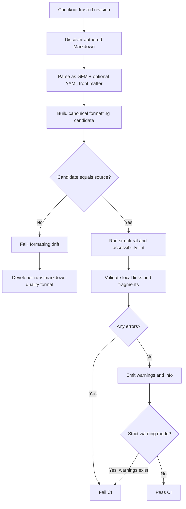

# Opinionated defaults for `markdown-quality`

## Executive summary

`markdown-quality` already has unusually strong foundations for an opinionated Markdown policy: it parses GFM explicitly, layers `@eslint/markdown` recommended rules with table and GitHub-alert checks, formats through Prettier with `proseWrap: "preserve"`, applies Snapper semantic sentence wrapping, validates local links, forbids unsafe trailing-whitespace hard breaks, and checks that formatting preserves parsed meaning and converges. fileciteturn8file0 fileciteturn9file0 fileciteturn19file0

The main recommendation is therefore **not** to replace the current architecture with markdownlint or remark. It is to make the existing architecture more explicitly opinionated and versioned:

> **Formatter owns syntax style; linter owns correctness, accessibility and ambiguity; the GFM parser owns semantics.**

I recommend introducing an immutable **`authored-gfm@2`** preset rather than silently changing `authored-gfm@1`. The present schema fixes the only preset to `authored-gfm@1`, exposes only a few layout options, and supports only `off`, `warn`, and `error`; several requested policies therefore need a schema/preset revision. fileciteturn4file0 The current implementation also maps diagnostics to only warning/error, so genuine informational diagnostics require an implementation change. fileciteturn8file0

The central defaults should be:

| Area | Recommended opinion |
|---|---|
| Dialect | **GFM**, explicitly |
| Prose wrapping | **One sentence per soft line; no hard column limit** |
| Long lines | **120 characters informational only**, excluding literals/tables/URLs |
| Line endings | **LF** |
| Lists | `-` unordered; `1.`, `2.`, … ordered; one space after marker |
| Headings | ATX `#`, no closing hashes; hierarchy errors; at most one H1 |
| Fences | Backticks; fenced rather than indented; **language required** |
| Embedded code | Preserve; do not reformat |
| Emphasis | `*emphasis*`, `**strong**` |
| Block spacing | One blank line around block constructs; max one consecutive blank line |
| Hard breaks | Explicit `\` + newline; never trailing-space hard breaks |
| Tables | Canonical GFM pipe layout; column-count correctness is an error |
| Links | Preserve inline/reference choice; validate references and local targets |
| Bare URLs | Allow GFM literal autolinks |
| Images | Meaningful alt text required |
| HTML | Allow and preserve |
| Front matter | Recognise optional **YAML** front matter but treat it as an extension and preserve it |
| Emoji | Preserve Unicode emoji and `:shortcodes:`; do not convert either way |
| Smart punctuation | Off/preserve |
| Unicode normalisation | Preserve bytes; optionally report non-NFC prose as `info` |
| Severity | `error` blocks CI; `warn` does not by default; `info` is advisory |
| Formatting drift | Blocks CI, but is automatically fixable by `format` |

This matches GFM's status as a strict CommonMark superset while deliberately exploiting its tables, task lists, strikethrough and extended autolinking. citeturn12view0turn13view1turn13view0turn13view2 It also follows the ecosystem's emerging separation of responsibilities: `@eslint/markdown` explicitly says it does not provide formatting rules and recommends a formatter such as Prettier. citeturn15view0

## Evidence and ecosystem comparison

There is broad agreement on correctness rules, but much less agreement on stylistic details such as bullets and line width. That argues for **strong package opinions where formatting is deterministic**, and restraint where rules are editorial rather than syntactic.

| Tool/config | Wrapping / line length | Lists / headings | Fences / links / HTML | Important implication |
|---|---|---|---|---|
| **Prettier 3.9** | `printWidth: 80`, but this is a formatting target rather than a maximum; Markdown `proseWrap` defaults to `preserve` | Primarily formatter-owned; repairs ordered-list numbering | Supports GFM; Markdown parser moved to modern micromark in 3.9 | Good layout engine, poor choice for semantic prose policy by itself. citeturn10search0turn10search2 |
| **`@eslint/markdown` recommended** | No formatting rules | Requires heading increments, max one H1, valid references, emphasis spacing | Requires fence languages and alt text; validates table column counts; HTML and bare-URL bans are *not* recommended | Excellent correctness baseline; switch explicitly from its CommonMark default to `markdown/gfm`. citeturn15view0 |
| **markdownlint / VS Code defaults** | Notably disables MD013 line length because many real files exceed 80 columns | Strong structural/style rule set | Has rules for fence languages, HTML and bare URLs | Strong evidence against treating 80 columns as a universal Markdown error. citeturn14search0turn14search1 |
| **GitHub `markdownlint-github`** | Inherits markdownlint base | Requires heading hierarchy, single H1 and sequential ordered lists; unusually prefers `*` bullets | Allows inline HTML and bare URLs; requires fenced-code languages; adds accessibility rules | Most relevant external opinion for GitHub-authored Markdown; particularly supports allowing HTML/bare GFM URLs and requiring fence languages. fileciteturn12file0 fileciteturn13file0 |
| **remark-lint recommended + consistent** | Style is mostly consistency-oriented rather than a fixed global width | Checks marker consistency; recommended list-item indent is one space | Recommended preset targets mistakes and cross-vendor problems | Useful evidence that portability/correctness should be stronger than arbitrary stylistic rules. citeturn11search0turn11search5 |
| **Current `markdown-quality`** | Snapper sentence-per-line, `max_width = 0`, `clause_breaks = false`; Prettier preserves prose wrapping | Prettier owns layout | GFM parser; ESLint recommended + table check + GitHub alerts; local-link validation | Already points towards the right policy: semantic lines rather than fixed-width prose. fileciteturn21file0 fileciteturn8file0 |

The line-length question is the clearest place to **avoid copying a conventional default blindly**. Prettier's own documentation says its width is not a hard `max-len`; vscode-markdownlint disables MD013 by default; and `markdown-quality` already ships Snapper with unlimited sentence width. citeturn10search2turn14search0 Snapper's documented default is `max_width = 0`, with an advisory long-line threshold of 120 when width is unlimited. citeturn17search1

That is a better fit for documentation source control: one sentence per line keeps prose diffs semantic, whereas hard-wrapping a sentence at 80 columns can cause multiple otherwise meaningless changed lines after a small edit. Snapper is specifically designed around that rationale. citeturn17search0

One deliberate divergence from GitHub's own `markdownlint-github` config is worth calling out: GitHub chooses `*` for unordered lists. fileciteturn13file0 I recommend `-` for `markdown-quality`. GFM considers `-`, `+`, and `*` valid bullet markers, so this is purely a source-style opinion. citeturn16search1 Using `-` visually separates list syntax from `*emphasis*` and harmonises ordinary lists with the conventional GitHub task-list form.

## Recommended preset

The following is intentionally a **proposed package-level `authored-gfm@2` policy**, not a claim that today's v1 schema accepts every field. The current public schema is too narrow for these decisions and should remain capable of loading `authored-gfm@1` unchanged. fileciteturn4file0

```json
{
  "schemaVersion": 2,
  "preset": "authored-gfm@2",

  "syntax": {
    "dialect": "gfm",
    "frontmatter": "yaml",
    "html": "allow",
    "emojiShortcodes": "preserve"
  },

  "format": {
    "endOfLine": "lf",
    "tabWidth": 2,
    "finalNewline": true,

    "proseWrap": "sentence",
    "maxProseWidth": 0,
    "longLineThreshold": 120,
    "clauseBreaks": false,

    "headingStyle": "atx",
    "closingHeadingHashes": false,

    "unorderedListMarker": "-",
    "orderedListDelimiter": ".",
    "orderedListNumbering": "ordered",
    "spacesAfterListMarker": 1,

    "codeBlockStyle": "fenced",
    "fenceMarker": "`",
    "fenceLanguage": "required",
    "embeddedCodeFormatting": "off",

    "emphasisMarker": "*",
    "strongMarker": "**",

    "blankLinesAroundBlocks": 1,
    "maxConsecutiveBlankLines": 1,

    "hardBreakStyle": "backslash",
    "trailingWhitespace": "forbid",

    "tableStyle": "gfm-pipe",
    "tableCellPadding": true,

    "linkStyle": "preserve",
    "smartPunctuation": "preserve",
    "unicodeNormalization": "preserve"
  },

  "lint": {
    "markdown/fenced-code-language": "error",
    "markdown/heading-increment": "error",
    "markdown/no-duplicate-definitions": "error",
    "markdown/no-empty-definitions": "error",
    "markdown/no-empty-images": "error",
    "markdown/no-empty-links": "error",
    "markdown/no-invalid-label-refs": "error",
    "markdown/no-missing-atx-heading-space": "error",
    "markdown/no-missing-label-refs": "error",
    "markdown/no-missing-link-fragments": "error",
    "markdown/no-multiple-h1": "error",
    "markdown/no-reference-like-urls": "error",
    "markdown/no-reversed-media-syntax": "error",
    "markdown/no-space-in-emphasis": "error",
    "markdown/no-unused-definitions": "error",
    "markdown/require-alt-text": "error",
    "markdown/table-column-count": "error",

    "quality/duplicate-sibling-heading": "warn",
    "quality/generic-link-text": "warn",
    "quality/heading-trailing-punctuation": "info",
    "quality/long-prose-line": "info",
    "quality/non-nfc-prose": "info"
  },

  "links": {
    "localFiles": true,
    "rootRelative": "reject",
    "preferRelativeRepositoryLinks": true,
    "bareUrls": "allow-gfm"
  },

  "severity": {
    "failOn": "error",
    "strictFailOn": "warn",
    "infoAffectsExitCode": false
  }
}
```

The explicit ESLint set largely makes `@eslint/markdown`'s recommended policy visible instead of depending invisibly on upstream defaults. Those recommended rules currently include fence languages, heading increments, definition/reference validation, one H1, image alt text and GFM table column counts. HTML, duplicate-heading and bare-URL prohibitions are intentionally not in its recommended set. citeturn15view0

A migrated consumer configuration should consequently remain small:

```json
{
  "schemaVersion": 2,
  "preset": "authored-gfm@2",
  "include": ["*.md", "docs/**/*.md", ".github/**/*.md"],
  "exclude": ["docs/generated/**", "docs/vendor/**"],
  "lint": {},
  "links": {
    "localFiles": true,
    "rootRelative": "reject"
  }
}
```

### Why these opinions

**Wrapping and line length.** Keep the current sentence-per-line behaviour and unlimited width. A soft newline is semantically safe in CommonMark/GFM prose: a normal line ending that is not preceded by two spaces or a backslash is a soft break, which browsers render equivalently to a space/newline. citeturn13view3turn13view4 Make 120 characters advisory only; do not count URLs, table rows, inline literals or code blocks. This preserves readable diagnostics without recreating MD013's well-known friction. citeturn14search0turn17search1

**Lists.** Canonicalise unordered lists to `-`, ordered delimiters to `.`, and renumber ordered lists sequentially. CommonMark disregards later ordered-list numbers for rendering, but source numbering remains useful to humans; Prettier already repairs list numbering and explicitly documents repeated `1.` as an opt-out for users prioritising diff minimisation. citeturn10search3turn16search1 One space after markers also agrees with remark-lint's recommended setting. citeturn11search5

**Headings.** Canonicalise to open ATX headings and enforce level increments. GFM and current CommonMark formally support ATX headings and require appropriate spacing after the hashes. citeturn12view0turn16search1 Do **not** require H1 to be literally the first line: front matter, HTML comments, badges and other legitimate preambles make that overly restrictive. Enforce at most one H1 instead, which `@eslint/markdown` already recommends. citeturn15view0 Heading punctuation is editorial rather than structural, so it belongs at `info`, with question marks left legitimate.

**Code fences.** Prefer backtick fences, require an info-string language, and keep embedded-code formatting off. GitHub recommends fenced code with a language identifier for syntax highlighting, markdownlint has a dedicated required-language rule and suggests `text` when no highlighting is intended, and GitHub's own markdownlint configuration enables that rule. citeturn14search10 fileciteturn12file0 The package's current `embeddedLanguageFormatting: "off"` is the correct default for documentation examples because a Markdown formatter should not silently rewrite example programs. fileciteturn9file0

**Blank lines.** Use one blank line around headings, lists, fences, blockquotes and tables, and collapse multiple blank lines. Some such whitespace is optional under the grammar, but explicit separation reduces parsing surprises and source ambiguity; the GFM specification itself discusses ambiguities caused by hard-wrapped text around block boundaries. citeturn12view0 GitHub also recommends blank lines before and after fenced code blocks. This is a formatter concern rather than a semantic lint rule.

**Emphasis and strong.** Canonicalise to `*text*` and `**text**`; reject internal delimiter spacing. Both `*` and `_` are valid CommonMark/GFM emphasis, so the marker is purely stylistic, while malformed spacing can change parsing. citeturn16search1 `@eslint/markdown` therefore recommends `no-space-in-emphasis`; remark's formatter examples also use asterisks as a canonical output. citeturn15view0turn11search0

**Links and images.** Do not automatically convert inline links to references or references to inline links. Both are first-class CommonMark forms, and conversion can make a document less maintainable depending on whether a destination is repeated. Preserve the author's choice, while treating duplicate, missing, malformed and unused definitions as errors. citeturn15view0turn16search1 Keep the package's contained local-target checker and root-relative rejection: repository-relative links are easier to move and review, and GitHub documentation explicitly supports/recommends relative repository links. The current checker already validates link, image and definition targets without network access. fileciteturn8file0

**Bare URLs.** Allow them. Extended URL autolinking is an actual GFM extension, not accidental renderer behaviour, and GitHub's own markdownlint policy explicitly turns off `no-bare-urls`. citeturn13view2 fileciteturn12file0 A future strict-CommonMark profile could warn and suggest `<https://example.test>` instead.

**Images and accessibility.** Missing alt text should remain an error, while heuristics such as generic alt text can begin as warnings. GitHub itself actively encourages meaningful image descriptions, and `@eslint/markdown` recommends `require-alt-text`. citeturn18search1turn15view0 This is more defensible than trying to infer whether an image is decorative.

**Hard and soft breaks.** Preserve the package's new rule forbidding trailing-space hard breaks and converting actual hard breaks to visible backslash-newline form. Both syntaxes are valid GFM, but the backslash is explicit in source whereas invisible trailing spaces are fragile under editors and whitespace cleanup. citeturn13view3 The repository's current consumer guide already defines exactly this policy. fileciteturn19file0

**Tables and task lists.** Format GFM tables canonically and make mismatched column counts errors; do not apply prose width limits to table rows. GFM formally defines pipe tables as an extension. citeturn13view1 Canonicalise task markers to `- [ ]` and `- [x]`; GFM accepts either uppercase or lowercase `x`, so lowercase is simply the deterministic source form. citeturn13view0

**HTML.** Allow and preserve raw HTML. It is part of CommonMark/GFM syntax, GitHub performs its own post-rendering sanitisation, and GitHub's own markdownlint policy disables the blanket no-HTML rule. citeturn12view0 fileciteturn12file0 Banning HTML would unnecessarily exclude useful GitHub constructs such as `<details>` and richer image markup; `markdown-quality` should not try to become an HTML formatter.

**Front matter.** Recognise optional YAML front matter explicitly but treat it as a container extension, not as GFM. `@eslint/markdown` confirms that front matter is disabled by default in both its CommonMark and GFM parsers and requires an explicit `"yaml"`, `"toml"` or `"json"` language option. citeturn15view0 YAML is the best single opinionated default for repository documentation; TOML/JSON should require opt-in. The front-matter payload should be excluded from semantic prose wrapping.

**Emoji and smart punctuation.** Preserve both Unicode emoji and GitHub `:EMOJICODE:` source without converting between them; GitHub explicitly supports shortcode syntax, but it is a GitHub writing feature beyond the formal GFM core. citeturn19search0turn19search6 Likewise, never automatically change ASCII quotes/dashes into typographic punctuation. Those transformations are editorial, locale-sensitive and outside Markdown formatting.

**Unicode.** Do not rewrite a document to NFC automatically. Unicode defines NFC as canonical decomposition followed by composition, but canonical-equivalent strings can still have different bytes. citeturn11search2 For this package, that matters especially in code, URLs and filesystem targets, where byte-level rewriting is not merely typography. An optional `info` diagnostic for non-NFC **prose text only** is reasonable; automatic normalisation is not.

## Examples and diagnostics

A core principle should be that anything deterministic and harmless is formatted automatically; only things requiring author judgement should produce lint messages.

### Semantic wrapping

Before:

```markdown
The formatter should keep documentation readable while also producing small and useful source-control diffs. A tiny change should not reflow an entire paragraph.
```

After:

```markdown
The formatter should keep documentation readable while also producing small and useful source-control diffs.
A tiny change should not reflow an entire paragraph.
```

This uses ordinary soft breaks, not rendered `<br>` breaks. citeturn13view4

A very long but indivisible sentence would remain unchanged and optionally produce:

```text
README.md:42:1  info  Prose sentence exceeds 120 characters; consider simplifying it
                     quality/long-prose-line
```

It should **not** fail CI.

### Headings, lists and emphasis

Before:

```markdown
Project
=======

* first
* second

1) one
4) two

_useful_ and __important__
```

After:

```markdown
# Project

- first
- second

1. one
2. two

*useful* and **important**
```

All of those are style transformations over constructs valid in CommonMark/GFM; the package can therefore own one canonical representation. citeturn16search1

A structural error remains a diagnostic rather than being guessed at:

```markdown
# Project

### Installation
```

```text
README.md:3:1  error  Heading levels should increment by one level at a time
                    markdown/heading-increment
```

That rule is part of the `@eslint/markdown` recommended set. citeturn15view0

### Fences and hard breaks

Before:

````markdown
Example:
```
npm ci
```

First line··
Second line
````

where `··` represents two otherwise invisible trailing spaces.

After:

````markdown
Example:

```text
npm ci
```

First line\
Second line
````

Missing fence languages should be an error because an author must decide the correct language:

```text
README.md:3:1  error  Fenced code blocks must specify a language
                    markdown/fenced-code-language
```

Using `text` explicitly communicates that syntax highlighting is intentionally absent. citeturn14search10

### Links, tables and accessibility

Input:

```markdown
[setup][missing]


| Name | Value |
| --- | --- |
| one | two | extra |
```

Representative diagnostics:

```text
docs/guide.md:1:1  error  Link reference has no matching definition
                         markdown/no-missing-label-refs

docs/guide.md:3:1  error  Image requires alternative text
                         markdown/require-alt-text

docs/guide.md:7:1  error  Table row contains more cells than its header
                         markdown/table-column-count
```

These map directly onto recommended/current `@eslint/markdown` checks; the package already strengthens table checking and permits GitHub alert labels such as `!NOTE` and `!WARNING`. fileciteturn8file0

A generic link can instead be non-blocking:

```markdown
For details, [click here](docs/design.md).
```

```text
README.md:18:14  warning  Use descriptive link text instead of "click here"
                          quality/generic-link-text
```

That is consistent with GitHub's own accessibility-oriented Markdown configuration, which enables its `no-generic-link-text` rule. fileciteturn13file0

## Compatibility, migration and CI

### GFM and CommonMark boundary

The primary parsing mode should remain GFM. The formal GFM specification identifies GFM as a strict CommonMark superset and adds tables, task-list items, strikethrough and extended autolinking. citeturn12view0turn13view1turn13view0turn13view2 The package already configures both mdast/micromark and ESLint to parse GFM rather than relying on their CommonMark defaults. fileciteturn8file0

There is one versioning wrinkle worth making explicit in tests: GitHub's published formal GFM specification is still labelled **0.29-gfm from 6 April 2019**, while the current CommonMark specification is **0.31.2 from 28 January 2024**. citeturn12view0turn16search0 Prettier 3.9's move to modern micromark is consequently valuable because it improves contemporary CommonMark/GFM parser compliance rather than freezing behaviour to an old parser implementation. citeturn10search0

YAML front matter, emoji shortcodes, GitHub alerts and other GitHub writing conveniences should be documented separately as **supported extensions around GFM**, not falsely described as formal GFM syntax. `@eslint/markdown` itself treats front matter as an explicit opt-in extension. citeturn15view0

### Migration from `authored-gfm@1`

The largest process recommendation is to make preset identifiers **immutable contracts**. The current consumer guide says an unreleased stricter whitespace policy updates `authored-gfm@1` directly. fileciteturn19file0 For future compatibility, that should stop: behavioural changes capable of creating new findings or rewriting existing documents belong in `authored-gfm@2`.

A practical migration checklist is:

- Pin the existing package/preset, run the current checker and commit a clean baseline before changing policy.
- Add `authored-gfm@2` as an opt-in preset; never reinterpret existing `@1` installations.
- Run `format` once in a dedicated mechanical commit, so heading/list/fence/emphasis/blank-line changes are separated from content edits.
- Run `check` and manually resolve new correctness/accessibility errors; initially review `warn` and `info` without blocking.
- After the repository is clean, switch CI to `@2`; teams wanting zero-warning policy can enable strict mode separately.

A compatibility bridge can also report the delta before migration:

```text
markdown-quality inspect --preset authored-gfm@2 --migration-from authored-gfm@1
```

Conceptually, that should distinguish:

```text
would-format:  37 files
new-errors:     4
new-warnings:   9
new-info:      16
```

This is preferable to turning a package update into a surprise repository-wide rewrite.

### CI application order

Formatting should be validated **before** lint diagnostics so that linters see canonical source, but CI should never rewrite the checkout. Developers run `format`; CI checks the formatter fixed point.



This fits the package's existing safety model: checks do not write; formatting prepares candidates, compares parsed semantics, verifies convergence and validates the complete selected batch before replacement. fileciteturn9file0 fileciteturn18file0

I would change one current semantic, however: today the consumer guide says **warnings are unresolved findings and block formatting**. fileciteturn19file0 In `@2`, warnings should be non-blocking by default and `error` should be the normal CI threshold. Otherwise there is no meaningful difference between warning and error. A `--strict` mode can fail on warnings, matching the model used by remark's `--frail` workflow. citeturn11search0

## Validation rules and primary sources

The preset itself should be treated as tested product behaviour, not merely configuration.

The most important tests are **conformance, fixed-point, preservation and severity tests**. CommonMark publishes its examples as conformance tests, and the GFM specification likewise says its examples are intended to double as conformance tests. citeturn16search0turn12view0 `markdown-quality` should select representative upstream cases plus exhaustive regression fixtures for every opinionated transformation.

| Test family | Required assertion |
|---|---|
| CommonMark core | Supported CommonMark constructs parse to expected structure under GFM mode |
| GFM extensions | Tables, task lists, strikethrough and extended autolinks parse/render as expected |
| Formatter fixed point | `format(format(x)) === format(x)` |
| Semantic preservation | Parsed semantic tree before/after formatting is equivalent |
| Literal preservation | Code blocks, inline code, raw HTML and preserved front matter do not change unexpectedly |
| Sentence wrapping | Formatting inserts only soft breaks in normal prose; no accidental hard breaks |
| Hard-break canonicalisation | Two-space parsed hard break becomes `\` + newline; trailing prose whitespace is absent |
| Lists | `*`/`+` normalise to `-`; `)` to `.`; ordered numbering becomes sequential without changing list contents |
| Headings | Setext becomes ATX; hierarchy violations remain lint errors rather than guessed fixes |
| Fences | Indented/fenced policy converges; missing language reports error; literal body remains byte-stable |
| Tables | Formatter converges; extra cells trigger `table-column-count` |
| Links | Missing definitions/fragments/local targets error; inline/reference form is otherwise preserved |
| Images | Missing alt text errors; descriptive alt survives formatting |
| Front matter | YAML preamble is recognised and excluded from prose transformations |
| HTML | HTML blocks survive byte/semantic preservation checks |
| Emoji | Unicode emoji and `:shortcode:` survive unchanged |
| Unicode | No automatic NFC/NFD rewrite; optional prose-only diagnostic has no effect on literals/URLs |
| Severity | Error → failing check; warning → pass normally/fail under strict; info → always non-failing |
| Cross-platform | LF output is identical on supported Windows/Linux Node versions |

Several of those invariants already exist: the current formatter compares parsed semantic trees, explicitly preserves code-span and raw-literal semantics, and verifies a second formatting pass produces identical output. fileciteturn9file0 Those are excellent properties and should become documented guarantees of `authored-gfm@2`, not be weakened in pursuit of more aggressive formatting.

The strongest primary references for maintaining the preset are:

- **GitHub Flavored Markdown specification** — authoritative GFM grammar and extension semantics. citeturn12view0
- **CommonMark 0.31.2 specification and tests** — current portable Markdown core. citeturn16search0turn16search1
- **GitHub writing documentation** — GitHub-specific authoring behaviour such as headings, relative links and emoji. citeturn19search0turn19search6
- **`@eslint/markdown`** — current lint-rule semantics, GFM language mode and front-matter options. citeturn15view0
- **Prettier options and Markdown parser notes** — formatter semantics, prose wrapping, LF/tab defaults and current micromark-based Markdown parsing. citeturn10search0turn10search2
- **markdownlint / vscode-markdownlint** — useful cross-check of conventional structural rules, particularly the decision not to impose MD013 globally. citeturn14search0turn14search10
- **GitHub `markdownlint-github`** — the most relevant external opinionated configuration for GitHub repositories and accessibility. citeturn18search7 fileciteturn12file0 fileciteturn13file0
- **remark-lint** — useful reference for portability, consistency and severity design. citeturn11search0
- **Unicode Standard Annex #15** — normative Unicode normalisation definitions. citeturn11search2
- **Snapper** — the rationale and exact semantics behind the package's existing sentence-per-line, unlimited-width policy. citeturn17search0turn17search1

The resulting design is intentionally stricter about **correctness, accessibility, deterministic source form and repository integrity**, but comparatively restrained about **editorial prose style**. That distinction is the key to an opinionated Markdown package that remains pleasant to adopt: machines should automatically settle questions such as bullets, fences, whitespace and headings; they should report genuine broken structure as errors; and they should avoid pretending that line length, heading punctuation, smart quotes or link-reference preference have one objectively correct answer.