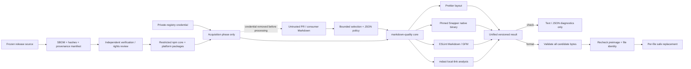
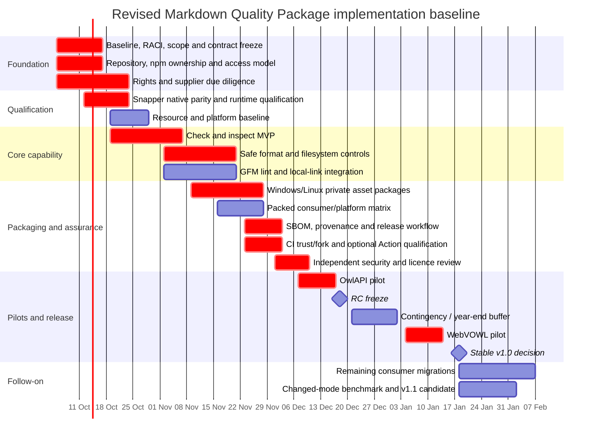

# Validation and Deepening of the Shared Markdown Quality Package Implementation Plan

## Executive summary

The attached implementation plan is unusually strong as a **technical assurance and requirements dossier**. It already defines fourteen requirements and acceptance criteria, eleven quality scenarios, fourteen architectural decisions, ten vertical implementation slices, eleven explicit gates, migration safeguards, failure semantics, rollback principles, and a thoughtful distinction between read-only checking and controlled document mutation. It also correctly treats private-package credentials, native executable redistribution, licence provenance, Windows/Linux filesystem behaviour, and cross-repository adoption as first-class risks rather than implementation details. fileciteturn0file0 The companion software-selection record is similarly disciplined: it identifies concrete candidate versions, separates maintained capabilities from residual custom code, records donor provenance, and explicitly leaves binary parity and rights clearance unresolved rather than declaring them solved. fileciteturn0file1

The principal weakness is different: **the document is much closer to an assurance case than an executable programme plan**. It says, in impressive detail, what must eventually be true, but is materially less complete on who will do each item, when it will be done, the critical path, budget and capacity, decision deadlines, release-support policy, operational ownership after launch, and the quantitative thresholds by which the programme will be managed. Several roles are intentionally left for later assignment and the ten slices have dependencies but no calendar dates or effort estimates. fileciteturn0file0

My overall assessment is therefore **“proceed, but rebaseline before implementation”**. The architecture is fundamentally sound; a rewrite is not warranted. I recommend retaining approximately 80–90% of the technical design while making five material changes:

1. **Split the programme into a smaller v1.0 and a subsequent v1.1.** Move changed-document optimisation and unchanged-referrer dependency analysis out of the v1.0 critical path. Full-scope checking is already the plan's safe default; the changed-mode logic is one of the highest-complexity correctness surfaces and should be introduced only when measurements demonstrate that full checks are too expensive. fileciteturn0file0
2. **Make the CLI the canonical CI integration and the composite GitHub Action optional.** A private cross-repository Action creates a visibility constraint: GitHub documents private action/workflow sharing primarily between appropriately authorised private repositories, while a public caller can use public reusable workflows; a cross-repository custom action for general use must be publicly available. Consumer visibility therefore needs to be classified before DEC-011 is accepted. citeturn14search0turn14search6turn17search15
3. **Turn GATE-11 into a pre-pilot architecture gate, not merely a late CI qualification step.** Fork PRs and private npm credentials are a genuine security boundary. GitHub explicitly warns that `pull_request_target` gains elevated access and becomes unsafe when PR-controlled code is fetched and executed; the safer `pull_request` context deliberately withholds secrets from fork PRs. citeturn14search1turn14search7
4. **Raise supply-chain assurance from “asset hashes and dependency inventory” to a release provenance model:** SBOM, exact upstream/native provenance, frozen source and build inputs, full-SHA-pinned Actions, immutable release identities, supplier due diligence, and verifiable release attestation where the chosen GitHub entitlement supports it. This aligns the project with NIST SSDF, NIST's July 2026 software-supply-chain due-diligence guidance and SLSA 1.2's source/build provenance model. citeturn13search1turn13search5turn13search10turn13search15
5. **Add programme-management artefacts missing from the draft:** RACI, dated milestones, budget, capacity plan, KPI dashboard, decision log/ADRs, support/deprecation policy, incident/vulnerability process, and a frozen release-evidence manifest.

A reasonable planning baseline is **144 person-days**, approximately **£115,850 of direct labour**, plus **20% contingency**, for a central programme envelope of **£139,020**, excluding existing GitHub/npm subscriptions, VAT/tax, and unusual external legal work. This is a planning estimate using explicit assumed day rates, not a market quotation.

On a realistic staffed schedule, work can begin with baseline/rights qualification on **5 October 2026**, reach a first pilot in December, a second pilot in January, and target a stable v1.0 around **18 January 2027**, with remaining migrations and the optional changed-mode capability following thereafter.

The revised programme should have a simple success definition:

> **v1.0 is complete when the same frozen package release can be installed reproducibly on supported Windows x64 and Ubuntu x64 environments, check and safely format owner-approved Markdown scopes without semantic/literal corruption or runtime acquisition, produce stable versioned results, pass independent security/licence/release assurance, and replace duplicated tooling in two materially different pilot repositories without weakening their existing CI controls.**

That is narrower and more measurable than “complete all ten slices”, while remaining faithful to the intent of the original plan. fileciteturn0file0

## Baseline assessment and assumptions

The current plan's strongest feature is that it does **not** mistake a formatter wrapper for a trivial utility. It correctly recognises at least five separate trust boundaries: repository content, configuration, filesystem writes, native executable distribution, and CI/private-registry credentials. It also specifies unusually good failure semantics: explicit empty selection is not “all”; `check` is read-only; output is validated before writes; preimages are checked before replacement; operational failures are distinguished from content findings; and partial format commits must be reported truthfully. fileciteturn0file0

The software-selection research supports the principal composition rather than undermining it. Prettier exposes supported API and ignore handling, including `getFileInfo()` with `ignorePath` and a `resolveConfig: false` option when configuration discovery is unwanted. citeturn18search2 `@eslint/markdown` natively supports both CommonMark and GFM and explicitly states that it is not itself a formatter, recommending a formatter such as Prettier; that makes the proposed separation of layout formatting and structural linting architecturally reasonable. citeturn18search1 Snapper 0.11.7 is a real current upstream release with Windows x64 and Linux x64 prebuilt assets, so native packaging is technically plausible rather than speculative. citeturn18search0

At the same time, Snapper deserves stricter change control than an ordinary mature dependency. Its upstream release history shows versions 0.11.0 through 0.11.7 between **8 September and 23 September 2026**. That is not evidence of poor quality, but it is evidence of a fast-moving component and strengthens the case for freezing and qualifying a specific version rather than tracking “latest”. citeturn18search0 The attached research already reaches essentially the same conclusion by requiring standalone-versus-wheel parity qualification and exact archive identities before DEC-003 is final. fileciteturn0file1

Node 24 is also a reasonable initial target. As of the research date, official Node.js release information classifies v24 “Krypton” as LTS while v26 remains Current; Node's own guidance recommends production applications use LTS releases. citeturn18search3turn18search5 There is consequently no programme benefit in changing the v1.0 runtime to Node 26 merely because it is newer.

The following table separates what should be retained from what should change.

| Plan element | Current position | Assessment | Revised position |
|---|---|---|---|
| Product objective | One common Markdown formatting, linting, selection and local-link capability across repositories. fileciteturn0file0 | **Retain.** Clear organisational value and bounded product. | Make “two successful pilots with duplicate-tool retirement and no weakened controls” the v1.0 outcome. |
| Requirements / acceptance | REQ-001–014 with explicit ACs. fileciteturn0file0 | **Strong.** Better than many implementation plans. | Retain IDs; add owner, release target and test/evidence pointer to every AC. |
| Risk route | Internal HISEW R2 route. fileciteturn0file0 | Useful internally, but insufficient as the external benchmark. | Map HISEW controls to NIST SSDF, NIST C-SCRM/Supplier Due Diligence and SLSA evidence. |
| Tool composition | Prettier + Snapper + ESLint Markdown + mdast + Ajv. fileciteturn0file1 | **Technically justified.** | Keep for v1; freeze exact versions at RC and qualify upgrades independently. |
| Platforms | Windows x64 and Ubuntu 24.04 x64 initially. fileciteturn0file0 | **Correctly narrow.** | Retain; expressly make every other OS/CPU/libc a post-v1 qualification. |
| Full vs changed checking | Full default plus sophisticated changed/referrer-aware mode. fileciteturn0file0 | Changed mode has disproportionate complexity and correctness risk. | v1.0: full check only. v1.1: changed mode only after performance evidence establishes need. |
| `format` | Validates entire batch before writes, then safely replaces files with preimage checks. fileciteturn0file0 | **Strong design.** | Retain; explicitly add fault-injection qualification and rollback rehearsal. |
| Thin Action | Composite Action shared across consumers. fileciteturn0file0 | Visibility/fork constraints can make it unsuitable for some consumers. | CLI invocation in consumer-owned workflow is canonical; Action is optional convenience. |
| Private npm | Restricted private core/platform packages. fileciteturn0file0 | Reasonable but needs stronger release/auth model. | Use npm Trusted Publishing/OIDC for publishing where supported; read-only granular token only for private acquisition. |
| Supply-chain evidence | Archive hashes, asset inventory, dependency graph, notices. fileciteturn0file0 | Good foundation, incomplete provenance model. | Add SBOM, source/build/repack manifest, attestations/signatures, supplier due diligence and release evidence bundle. |
| Licensing | `AGPL-3.0-only`, conditional on donor/dependency/asset review. fileciteturn0file0 | Correctly conditional. | Make rights clearance a hard pre-incorporation gate with a corresponding-source delivery procedure. |
| Release/versioning | Coordinated release identity but limited explicit policy-default versioning. fileciteturn0file0 | Needs stronger consumer compatibility contract. | Version CLI/API, config schema, result schema **and policy preset**. |
| Resource plan | Roles named conceptually; many to be assigned later. fileciteturn0file0 | **Gap.** Accountability can become late-stage blocking. | Assign RACI before development starts. |
| Schedule | Dependency-ordered slices, no calendar baseline. fileciteturn0file0 | **Gap.** No critical-path visibility. | Adopt dated 15-week v1.0 schedule plus migration follow-on. |
| Cost | No budget/capacity estimate. fileciteturn0file0 | **Gap.** Cannot prioritise scope against cost. | Baseline 144 person-days / £139k including contingency. |
| Operations | Observability and recovery discussed. fileciteturn0file0 | Good concepts, incomplete operating model. | Add vulnerability SLA, incident owner, supported-version policy, upgrade cadence and release runbook. |

**Assumptions used in this review.** The owner-selected directions of a dedicated repository, private npm packages and `AGPL-3.0-only` remain in force. The exact repository visibility, npm organisation/entitlements, CI fork policies and the public/private status of all consumers have not been supplied, so those are treated as unresolved constraints rather than silently assumed. The five consumers identified in the attached research are treated as the candidate estate; I have not treated the historical 3 October donor test observations as present-day qualification evidence. fileciteturn0file1

HISEW is treated here as an **internal governance framework**. The plan identifies version `0.1.0.dev16` and internal concepts including R2, NSH-01 and verification profiles. fileciteturn0file0 I found no public authoritative specification for those identifiers during this research, so HISEW should remain the project's internal execution wrapper while externally recognisable controls and evidence are mapped to standards that reviewers can independently inspect.

The cost figures below assume UK-style contractor/loaded-cost planning rates solely for budgeting: £900/day technical lead, £725/day senior engineering, £800/day DevSecOps/release, £750/day independent QA/security verification, £1,400/day specialist licensing review and £850/day product/consumer ownership. They are **planning assumptions, not researched market quotations**.

## Benchmark and technical validation

The most useful external benchmark is not another Markdown tool project; it is a combination of **secure SDLC, software-supply-chain provenance, package-manager security and CI trust guidance**.

NIST's final SSDF v1.1 describes a set of high-level secure-development practices designed to be integrated into an organisation's SDLC, with a common vocabulary for software producers and acquirers. The plan already covers much of the substance—requirements, protected artefacts, controlled build/install, verification and recovery—but it should make that mapping explicit so evidence is not encoded only in project-specific REQ/QA/GATE terminology. NIST has an SSDF v1.2 revision in draft, but as of 4 October 2026 that remains an **Initial Public Draft**; final v1.1 is therefore the correct normative benchmark while the draft can be monitored for changes. citeturn13search1turn13search2turn13search7

For the native Snapper binaries and third-party dependency chain, the newly finalised **NIST SP 1326** is especially relevant. Published in July 2026, it frames software-supply-chain due diligence in terms including provenance, resilience, foundational cybersecurity practices and supply-chain tiers. That is a better model for GATE-03/GATE-04 than licences and checksums alone. citeturn13search5 A Snapper release archive's SHA-256 tells the project which byte sequence it acquired; it does not by itself answer who produced it, what source revision corresponds to it, whether the re-packaged bytes were altered, or what runtime dependencies accompany it. The existing selection record correctly recognises this limitation. fileciteturn0file1

SLSA 1.2 provides an appropriate model for the resulting release evidence. Its Build Track centres on provenance describing what built an artefact, the process and the inputs, while the Source Track concerns the trustworthiness and creation of source revisions. citeturn13search10turn13search13turn13search15 The project does not need to claim a particular SLSA level on day one; it should, however, structure evidence so that every npm/native artefact can be traced from consumer package → released package hash → build/repack process → reviewed source/native input.

That means the release inventory should expand from the current native digests to something like:

| Release evidence | Required v1.0 content |
|---|---|
| Source identity | Git commit SHA, immutable release/tag identity, dirty-state = false |
| JS graph | `package-lock.json`, resolved dependency graph, package archive digest |
| SBOM | SPDX or CycloneDX SBOM for the frozen release |
| Native origin | Upstream release/tag, archive URL identity in internal evidence, upstream archive digest |
| Native repack | Extractor/version, file inventory, extracted executable/DLL hashes, package archive hash |
| Rights | Exact licence expressions, notices, donor provenance and clearance decision |
| Build | Workflow/release job identity, environment/runtime versions, tested package tuple |
| Verification | focused/affected/full result references plus independent verification disposition |
| Consumers | pilot package-lock identity, configuration digest and accepted delta manifest |
| Recovery | prior package/config/workflow identity and tested restoration procedure |

The tooling already exists for part of this: current npm documentation provides `npm sbom` output in SPDX or CycloneDX formats, and `npm ci` provides a frozen install that errors on package/lock disagreement and does not rewrite package metadata. Current npm also supports script controls including `--ignore-scripts`, matching the plan's desire for script-free installation. citeturn15search3turn15search5

The plan's publication credential model should be modernised before implementation. npm currently recommends **Trusted Publishing**, which uses OIDC to avoid long-lived publication tokens, and states that legacy access tokens were removed in November 2025. npm separately recommends a read-only granular token when private dependencies must be installed. citeturn15search0turn15search1 Therefore:

> **Publish credential:** OIDC Trusted Publishing from a reviewed GitHub-hosted release workflow.  
> **Consumer acquisition credential:** read-only, granular private-package credential.  
> **Runtime:** neither credential.

There is an important provenance caveat: npm's automatic trusted-publishing provenance currently applies only when publishing a **public package from a public repository**; it does not generate this provenance for private repositories. citeturn15search1 Because the proposed package is private, the project should not promise npm provenance that its delivery model cannot produce. Instead, create an internal provenance/release manifest and, where organisational GitHub capabilities permit, an independently verifiable artifact attestation. GitHub describes artifact attestations as a mechanism for establishing build provenance and provides verification of attestations against artifact digests. citeturn17search0turn21search15

The draft's concern about first publication is also valid and should become an explicit prohibition. npm's current documentation states that **staging a package which does not yet exist publishes a publicly visible `0.0.0-stage` placeholder**, even though the staged contents themselves remain private until approval. citeturn19search3turn19search5 For a package whose stated requirement is private distribution, do **not** use first-ever staged publication without an explicit decision accepting that public placeholder. Establish the private/restricted package identity through an approved restricted path and read back its visibility before consumers depend on it.

The largest unresolved architecture issue is CI trust. GitHub's current guidance is unusually explicit: `pull_request` runs from the PR merge context but strips secrets and restricts the token for forked PRs; `pull_request_target` executes in the trusted base context with elevated credentials. It becomes dangerous when authors then fetch and execute fork-controlled content, including build scripts, dependency definitions or configuration. GitHub calls this the “pwn request” pattern and is introducing default restrictions against `pull_request_target` for public repositories, with enforcement scheduled for **2 November 2026** for affected repositories. citeturn14search1turn14search13

The proposed package has one useful security characteristic: repository Markdown can be treated as **data**, not executable code. That should be made a hard architectural principle for any privileged checking path:

A privileged fork workflow must therefore **never** execute a PR's `package.json` scripts, JavaScript configuration, replacement CLI, workflow, Makefile or dependency graph. The plan already says repository JavaScript configuration should not be loaded and warns against unsafe `pull_request_target`; that should move from explanatory prose into an acceptance criterion for CI architecture. fileciteturn0file0 GitHub's guidance supports precisely this separation of privileged operations from untrusted executable content. citeturn14search1

The other CI problem is distribution of the Action itself. GitHub documents private workflow/action sharing between authorised private repositories, and its reusable-workflow accessibility matrix says public callers have access to public workflow repositories, not private ones. citeturn14search0turn14search6 Therefore **the shared CLI, not the composite Action, should be the product contract**. A private consumer can optionally use the central Action; any consumer for which that is impossible can perform the same locked `npm ci` + CLI invocation in a repository-owned workflow. This also better satisfies the plan's stated requirement that local and CI semantics come from one release rather than from duplicated orchestration. fileciteturn0file0

Every external Action in release and consumer workflows should be pinned to a **full commit SHA**, with an adjacent human-readable version comment if desired. GitHub explicitly provides a policy to require full-length SHA pinning, and its supply-chain guidance notes that full commit pinning prevents a movable tag from silently changing the executed action. citeturn17search5turn17search16

Finally, the licence gate should remain genuinely blocking. SPDX confirms that `AGPL-3.0-only` is the identifier specifically distinguishing version 3 only from “version 3 or later”. citeturn19search0turn19search2 The GNU AGPL distinguishes mere network interaction from conveying copies and contains corresponding-source requirements for conveyed object code as well as a separate network-interaction provision for modified remotely interactive programs. citeturn19search1 The precise implications for this private npm distribution and any incorporated donor source should be decided by the accountable rights owner or counsel; registry privacy should not be treated as a substitute for that review. The attached selection record is correct to require file-by-file donor and native-asset clearance first. fileciteturn0file1

## Revised target plan and architecture

The original requirements should stay, but the **release objectives and scope boundaries should be recast around incremental value and risk reduction**.

**Revised v1.0 objectives**

| Objective | v1.0 acceptance condition |
|---|---|
| Single implementation | OwlAPI and WebVOWL—or two approved materially different substitutes—consume the same exact package release without copied formatter/parser/installer logic. |
| Read-only trust | Every `check` qualification demonstrates zero checkout mutation, no runtime network request and no runtime credential requirement. |
| Formatting correctness | Owner-reviewed corpus has zero unaccepted literal/semantic changes; second formatting pass is byte-identical. |
| Stable diagnostics | Text and JSON report the same substantive findings and cannot confuse operational failure with clean content. |
| Supported delivery | Clean Windows x64 and Ubuntu 24.04 x64 consumers install the locked private release with lifecycle scripts disabled. |
| Native integrity | Exact Snapper release/archive/executable identity is frozen and native-vs-reference parity is accepted. |
| CI safety | Untrusted PR content is processed strictly as data; no privileged workflow executes PR-controlled code/configuration. |
| Supply-chain assurance | Frozen source, lockfile, SBOM, package/native digests, provenance manifest and rights inventory exist for every release candidate. |
| Pilot adoption | Two pilots retain every existing product-security/quality floor, have an accepted delta and demonstrate rollback. |
| Operational readiness | Named owners, support matrix, vulnerability process, upgrade policy, release runbook and recovery procedure are approved. |

**Explicitly defer from v1.0:** changed-document dependency analysis; macOS/ARM/musl; MDX; remote URL checking; cross-document heading-fragment validation; arbitrary consumer plugins; editor/watch/daemon support; global telemetry; general workflow orchestration. This is broadly consistent with the current exclusion list but further removes SLICE-005's selective-check complexity from the initial release. fileciteturn0file0

The changed mode is the single most attractive scope reduction. The current design must understand Git history, adds/deletes/renames, unusual filenames, dirty-state semantics, configuration/tool invalidation, and unchanged Markdown documents that refer to changed non-Markdown targets. fileciteturn0file0 That is an excellent eventual feature, but it is not necessary to demonstrate the core value proposition. Make full-scope checks the v1.0 correctness floor, measure them, and create v1.1 only if **p95 full-check time or CI cost violates an agreed budget**.

The revised release sequence should be:

| Stage | Capability | Promotion condition |
|---|---|---|
| Internal alpha | `check`, `inspect`; full selection; Prettier/Snapper/structural/link diagnostics; no writes | Core corpus + packed consumers pass on both platforms |
| Internal beta | Safe `format`; batch candidate validation; preimage/race handling | Fault injection, idempotence and byte-preservation evidence accepted |
| Release candidate | Private platform packages; CI reference workflow; SBOM/provenance; all v1 contracts frozen | Rights/security/independent verification complete |
| Pilot release | OwlAPI or approved first consumer | Complete old-vs-new delta accepted; hosted checks observed |
| Second pilot | WebVOWL or materially different consumer | Same release proves configuration variation without code duplication |
| Stable v1.0 | Frozen public contract/preset | Two pilots accepted; zero unresolved high risks |
| v1.1 candidate | Changed/referrer-aware selection | Benchmarks justify optimisation and complete Git-history implication corpus passes |

This gives the project a much cleaner definition of “done”: **stable is earned by actual consumer evidence, not by merely completing internal code slices**.

The configuration contract also needs one additional independently versioned concept: a **policy/preset version**. The existing plan versions configuration/result schemas, but default diagnostics are operationally part of the consumer contract: turning on a new lint rule can break CI without changing CLI syntax. fileciteturn0file0 Under Semantic Versioning, a product should explicitly declare its public API, incompatible public-API changes require a major version change, and a published version is immutable. citeturn16search2 For this product, define the public contract as:

`CLI + documented library API + configuration schema + result schema + exit meanings + preset/default diagnostic policy`.

A practical model is:

- **Patch:** implementation/security fixes that do not intentionally change accepted public semantics or default policy.
- **Minor:** backward-compatible opt-in features, new diagnostics only when disabled by default, additional supported inspection fields.
- **Major or new preset major:** changed default finding set, removed/renamed config/CLI/report fields, changed exit semantics, deliberately changed formatting output outside a previously documented equivalence.
- **Dependency update:** not automatically a patch. First run the corpus; version according to the observed contract delta.

That last rule is particularly important for Snapper: a dependency version number does not determine the impact on this package's public output.

The original gates should be condensed into **six executive gates** while retaining the detailed GATE IDs underneath:

| Executive gate | Constituent original concerns | Exit decision |
|---|---|---|
| Baseline | GATE-01, GATE-02, GATE-07 | Scope, repo/registry, RACI and HISEW/external assurance mapping approved |
| Rights and suppliers | GATE-03 | Donor, dependency, native asset and AGPL obligations accepted |
| Native and platform | GATE-04, GATE-05 | Binary parity, extraction, runtime dependencies and resource bounds accepted |
| CI trust and delivery | GATE-11 | Registry credentials, fork model and Action/workflow distribution proven |
| Release assurance | GATE-08, GATE-09 | Frozen candidate independently verified and exact artefacts published/read back |
| Consumer adoption | GATE-06, GATE-10 | Per-consumer scope/delta/hosted check/rollback accepted |

This preserves the original plan's good traceability while making decision-making manageable for stakeholders who do not need to navigate eleven gates and ten slices during every programme review. fileciteturn0file0

## Delivery model, resourcing and timeline

The programme needs separation between **implementation authority, acceptance authority and independent verification**. The current plan names Maksym Shostak as proposed scope/acceptance owner while several operational roles remain to be assigned. fileciteturn0file0 The revised RACI should be fixed before the first code is committed.

| Deliverable / decision | Product owner | Package technical lead | Engineers | DevSecOps / release | Independent verifier | Rights specialist | Consumer owner |
|---|---|---|---|---|---|---|---|
| Requirements / v1 scope | **A** | R | C | C | C | C | C |
| Architecture / public contracts | C | **A/R** | R | C | C | C | C |
| Donor/native rights clearance | C | C | I | I | C | **A/R** | I |
| Native/platform qualification | I | **A** | R | R | **R** | C | I |
| Package implementation | I | **A** | **R** | C | C | I | I |
| Security/fork architecture | C | R | C | **A/R** | **R** | I | C |
| Release workflow / registry | I | C | C | **A/R** | C | I | I |
| Frozen RC verification | I | C | C | C | **A/R** | C | I |
| Consumer migration | C | C | R | C | C | I | **A** |
| Stable promotion | **A** | R | I | R | C / veto on unresolved assurance | C / veto on unresolved rights | C |

`A` means accountable and `R` responsible; independence requires that the verifier is not the implementer whose work is being finally accepted.

The following resource baseline assumes work is shared across roles and that some activity is parallel rather than sequential.

| Role | Estimated effort | Assumed day rate | Planning cost | Principal work |
|---|---:|---:|---:|---|
| Package / technical lead | 24 days | £900 | £21,600 | Architecture, contract freeze, integration, technical decisions |
| Senior Node/TypeScript engineering | 60 days combined | £725 | £43,500 | Core CLI/library, selection, formatting, lint/link integration, tests |
| DevSecOps / release engineer | 20 days | £800 | £16,000 | Native packaging, registry, CI trust model, release/provenance |
| Independent QA/security verifier | 20 days | £750 | £15,000 | Threat-focused tests, platform qualification, independent RC review |
| Licence / rights specialist | 5 days | £1,400 | £7,000 | Donor/dependency/native licence and source-delivery review |
| Product + consumer owners | 15 days | £850 | £12,750 | Baseline, fixtures, pilot deltas, cutover acceptance |
| **Direct labour** | **144 days** |  | **£115,850** |  |
| **Contingency** |  |  | **£23,170** | 20% for native, rights, registry/fork surprises |
| **Planning envelope** |  |  | **£139,020** | Excludes existing service subscriptions and taxes |

The most likely cost drivers are not the formatter orchestration itself. They are the standalone native parity/redistribution decision, Windows filesystem edge cases, fork/private-package CI design, independent verification, and per-consumer migration analysis. That is another reason not to spend v1.0 effort on selective-diff optimisation before its economic value is demonstrated.

The schedule below starts on the first working day after the stated research date. It intentionally inserts independent-review and pilot gates instead of treating publication as the end of engineering.

The **critical path** is therefore approximately:

baseline → rights/native qualification → check/format capability → native package qualification → CI/release assurance → independent review → first pilot → second pilot → stable.

Changed-mode optimisation is deliberately absent from that critical path.

The milestone exit artefacts should be concrete:

| Milestone | Required evidence |
|---|---|
| Baseline freeze | Accepted requirements digest, RACI, repo/registry decision, support scope, risk register |
| Native qualification | Windows/Linux parity results, runtime/dependency inventory, archive/executable hashes, rights disposition |
| Alpha | Packed `check`/`inspect`, golden corpus, zero-mutation evidence |
| Beta | `format`, idempotence, fault injection, race/preimage tests, recovery evidence |
| RC freeze | Source SHA, locks, schemas, preset version, SBOM, npm/native tarball hashes, Action/workflow SHAs, independent review inputs |
| Pilot acceptance | Old/new scope + diagnostic + output delta, consumer tests, required-status readback, rollback rehearsal |
| Stable | Two accepted pilots, no unresolved high risk, release runbook, final rights/security sign-offs |

The communication model should likewise be explicit rather than implicit in PRs:

| Cadence / event | Audience | Mandatory output |
|---|---|---|
| Weekly 30-minute delivery review | Product owner, technical lead, DevSecOps, verifier | Critical-path status, newly opened/closed risks, decisions due within two weeks |
| Baseline gate | Owner + all accountable roles | Signed/recorded scope and RACI |
| Native/rights gate | Lead, verifier, rights owner | DEC-003/DEC-014 disposition |
| RC gate | Lead, DevSecOps, verifier, rights owner | Frozen evidence manifest; no mutable “latest” inputs |
| Pilot cutover review | Consumer owner + lead + verifier | Delta, CI evidence, rollback decision |
| Stable promotion | Product owner + release owner + verifier | Go/no-go and retained limitations |
| Security incident | Security/release owner + affected consumer owners | Impact, compromised identities, containment, replacement release and migration instructions |

## Risk, assurance and governance

The revised risk register below converts the plan's qualitative concerns into an executable management matrix. Scores use **likelihood × impact**, each on a 1–5 scale; 15–25 is High, 8–14 Medium, and 1–7 Low. Scores are planning judgements, not historical probabilities.

| Risk | L | I | Score | Rating | Mitigation / control | Owner |
|---|---:|---:|---:|---|---|---|
| Private-package credential exposed to untrusted fork PR code | 4 | 5 | **20** | High | Prefer `pull_request`; privileged path may treat candidate Markdown only as data; never run PR-controlled scripts/config/dependencies with secrets. GitHub specifically warns against the equivalent `pull_request_target` pattern. citeturn14search1 | Security/CI owner |
| Private shared Action incompatible with consumer visibility | 4 | 4 | **16** | High | Classify every consumer's visibility first; make direct CLI workflow canonical; Action optional. GitHub's sharing rules distinguish private/private reuse from public callers. citeturn14search0turn14search6 | Release owner |
| Policy/dependency upgrade unexpectedly breaks consumer CI | 4 | 4 | **16** | High | Lock versions, freeze preset, paired old/new corpus, semantic/preset versioning, consumer upgrade PRs. SemVer requires declared public API and major increments for incompatible API changes. citeturn16search2 | Package lead |
| Standalone Snapper binary differs from qualified reference or requires hidden runtime components | 4 | 4 | **16** | High | Native-vs-reference differential corpus, DLL/runtime inspection, exact hashes, unsupported-platform hard fail. | Package lead / verifier |
| Markdown formatting changes literals or meaning | 3 | 5 | **15** | High | Independently reviewed golden corpus, AST/render evidence where useful, idempotence, batch validation, preimages, two pilots. | Package lead |
| Native/dependency supply-chain compromise | 3 | 5 | **15** | High | Supplier due diligence, frozen hashes, SBOM, provenance/repack manifest, full-SHA Actions, immutable identities. NIST explicitly treats provenance and foundational supplier practices as due-diligence dimensions. citeturn13search5 | Security/release owner |
| AGPL/donor/native redistribution incompatibility | 3 | 5 | **15** | High | File-by-file provenance, exact licence inventory, corresponding-source procedure and rights sign-off before copying/release. citeturn19search1turn19search2 | Rights owner |
| Changed mode misses an unchanged referrer | 3 | 5 | **15** | High | Remove from v1.0; keep full checking; v1.1 only after exhaustive Git/referrer corpus. | Package lead |
| Windows junction/hard-link/locking edge case causes unsafe write | 3 | 4 | **12** | Medium | Platform adversarial fixtures, preimage/file-identity check, no unsupported hard-link writes, fault injection. | Engineering/verifier |
| First npm publication exposes unintended placeholder or wrong visibility | 3 | 4 | **12** | Medium | Do not stage a previously nonexistent private package; explicitly establish restricted identity and read back authorised/unauthorised access. npm documents public placeholders for new staged packages. citeturn19search3turn19search5 | Registry publisher |
| Cross-repository coordination exceeds available capacity | 4 | 3 | **12** | Medium | Two pilots first; one subsequent migration in flight per owner; migration manifests; no global switchover. | Product owner |
| Formatting rollback cannot recover original bytes | 2 | 5 | **10** | Medium | Retained preimages, exact baseline commit, rollback rehearsal; package downgrade is explicitly not treated as data rollback. | Consumer owner |
| Vulnerable dependency introduced during maintenance | 3 | 3 | **9** | Medium | Lockfile review, SBOM delta, vulnerability monitoring and dependency review where GitHub entitlement permits. GitHub dependency review can report vulnerable additions and enforce a PR check. citeturn21search0 | Package lead |
| Release publication credential compromised | 2 | 4 | **8** | Medium | npm OIDC Trusted Publishing; remove long-lived publish token; read-only acquisition token separately scoped. citeturn15search0turn15search1 | Release owner |

No High risk should be accepted implicitly. Each must be either closed, explicitly reduced below the threshold through evidence, or accepted in writing by the designated risk owner before stable promotion.

The **quality strategy** should combine the excellent scenario-based testing in the draft with five additional evidence classes:

- **Contract testing:** CLI, library, config schema, result schema, exit semantics and preset version.
- **Differential testing:** incumbent donor implementation versus candidate on exactly the same bytes; standalone Snapper versus qualified reference path.
- **Property/adversarial testing:** Unicode, malformed UTF-8, newline/bracket/option-like filenames, path traversal, symlinks/junctions/hard links, empty sets and repeated runs.
- **Fault injection:** native crashes/timeouts/truncated output, filesystem write interruption, concurrent preimage changes, registry acquisition failure and invalid Git state.
- **Packaged-system testing:** never qualify the release solely from source checkout. Install the exact tarball/native packages into clean consumers on supported systems.

The current plan already anticipates most of these, including real native paths rather than mocks, fault cases, packed consumers and independently owned expected values. fileciteturn0file0 The improvement is organisational: make each class a row in the RC evidence manifest and require an explicit status.

A concise KPI set will make that evidence monitorable:

| KPI / quality signal | v1.0 threshold | Response |
|---|---|---|
| Unaccepted semantic/literal corruption in accepted corpus | **0** | Release blocker |
| `check` mutation of checkout/tooling state | **0** | Release blocker |
| Formatter second-pass differences | **0** | Release blocker |
| Supported packed platform/install combinations passing | **100%** | Release blocker |
| Runtime network requests during check/format | **0** | Release blocker |
| Native/dependency components represented in release inventory/SBOM | **100%** | Release blocker |
| External Actions in release workflows pinned to reviewed full SHA | **100%** | Release blocker; GitHub supports enforcing full-SHA pinning. citeturn17search16 |
| Migrated consumers with approved scope/delta manifest | **100%** | Cutover blocker |
| Required pre-existing consumer CI controls lost | **0** | Cutover blocker |
| Operational-error rate in pilots | Track; target <1% of runs after stabilisation | Root-cause above threshold |
| False-positive/accepted-exception rate | Track by rule/tool; target <1% findings after pilot tuning | Review rule/preset |
| Full-check p95 runtime | Baseline in GATE-05; provisional target ≤125% of incumbent and within consumer CI budget | Only then consider v1.1 optimisation |
| Rollback rehearsal | Restore one pilot within **60 min** without unrelated changes | Stable blocker until demonstrated |
| High risks open at stable promotion | **0** | Stable release blocker |

The 125% performance and 60-minute recovery values are proposed management targets and should be replaced by measured values during GATE-05 if the consumers' actual CI budgets justify tighter or looser limits.

**Change control** should be formal but lightweight:

1. Protect `main`; require review from a named CODEOWNER for release workflows, package manifests, policy/preset and native-asset manifests.
2. Require an ADR for changes to the native distribution model, authentication/trust boundaries, public contract, licence model, supported platform or consumer execution model.
3. Before RC qualification, freeze a manifest containing source SHA, lockfile hash, fixture corpus hash, config/result schemas, preset identity, npm tarball hashes, native hashes, SBOM digest and workflow/Action SHAs.
4. Any change after freeze must state which evidence it invalidates. A README-only correction should not force platform requalification; a native binary or formatter update should.
5. Never rewrite an already published package version. SemVer explicitly requires a released version's content not to be modified; corrections receive a new version. citeturn16search2
6. Security hotfixes may accelerate review but do not bypass provenance, package hashing, supported-platform smoke tests or release attribution.

The release workflow itself should use `npm ci` against the frozen lockfile and avoid lifecycle execution unless an individual dependency has been explicitly assessed. npm's current `npm ci` semantics make package/lock mismatch a failure and avoid modifying the lock, while current script-policy controls support disabling or explicitly constraining lifecycle scripts. citeturn15search3turn15search10

Supply-chain monitoring should continue after release rather than end at GATE-08. Dependency changes should carry an SBOM delta and corpus delta; native Snapper upgrades should remain manual qualification events, not unattended version bumps. GitHub's dependency graph/Dependabot capabilities can provide vulnerability monitoring, while dependency review can help prevent newly vulnerable dependencies entering a PR where the repository's GitHub plan supports that feature. citeturn21search0turn21search4

## Prioritised actions and recommendation

The near-term objective should not be “start SLICE-001”. It should be **remove the few uncertainties that could invalidate the distribution architecture before substantial implementation effort begins**.

| Priority | Horizon | Action | Completion test |
|---|---|---|---|
| **P0** | First 2 working days | Accept a revised v1.0 baseline and explicitly defer changed-mode to v1.1 | Requirement digest and scope decision recorded |
| **P0** | First week | Assign RACI, especially rights owner, release/registry owner, independent verifier and each pilot consumer owner | No accountable role in a blocking gate is “TBD” |
| **P0** | First week | Classify dedicated package repo and all pilot consumers as public/private/internal; record fork policy | CI distribution matrix exists |
| **P0** | First week | Decide CI trust architecture: CLI canonical; privileged processing may treat PR Markdown as data but never execute PR-controlled code | Threat model and acceptance tests approved |
| **P0** | Weeks 1–3 | Complete donor/dependency/native asset rights review before source incorporation | Rights disposition and corresponding-source procedure approved |
| **P0** | Weeks 2–3 | Qualify Snapper 0.11.7 standalone Windows/Linux binaries against the reference installation and adversarial corpus | DEC-003 closed or explicitly rebaselined |
| **P0** | Weeks 1–2 | Prove restricted npm ownership/entitlement and publication path without creating an unintended public first-stage placeholder | Authorised/unauthorised access test recorded |
| **P1** | Weeks 3–5 | Deliver read-only `check` + `inspect` packed MVP first | Clean supported consumers pass with no writes/network at runtime |
| **P1** | Weeks 5–7 | Add safe `format` with preimage/race/fault evidence | Corpus idempotence and fault suite pass |
| **P1** | Weeks 5–7 | Integrate GFM structural lint and AST link checks | Positive/negative fixtures pass under stable diagnostics |
| **P1** | Weeks 6–9 | Build coordinated native npm packages and frozen release inventory | Exact core/platform tuple installs on both OS targets |
| **P1** | Weeks 8–10 | Add SBOM, provenance/repack manifest, full-SHA Action pins and OIDC publishing path | RC evidence manifest complete |
| **P1** | Weeks 9–10 | Independent security, filesystem, CI-trust and rights review | No unresolved High risk |
| **P1** | Weeks 10–11 | OwlAPI pilot | Delta accepted, required checks pass, rollback rehearsed |
| **P1** | Weeks 14–15 | WebVOWL pilot | Same release proves second consumer configuration and hosted CI |
| **P2** | From stable v1.0 | Migrate remaining three repositories individually | One accepted migration manifest and rollback point per repository |
| **P2** | Post-v1.0 | Measure full-check cost and decide whether changed-mode is economically warranted | Recorded go/no-go benchmark |
| **P2** | If warranted | Implement v1.1 changed/referrer-aware checks | Complete Git-history implication corpus; no selective false-clean cases |
| **P3** | Later | Evaluate macOS/ARM/musl, MDX, remote links or cross-document fragments independently | Separate business case and platform/capability qualification |

The **highest-priority architecture decision is GATE-11**, even though the draft currently places much CI realisation later in the slice sequence. A private npm package plus forked PRs plus a shared Action creates a three-way interaction between credentials, repository visibility and untrusted code. The plan has already identified the danger; external GitHub guidance confirms it is real, not theoretical. fileciteturn0file0 citeturn14search1turn14search6 Solving that before implementation prevents the programme reaching SLICE-006 only to discover that the chosen distribution model cannot serve a pilot safely.

The **second priority is native qualification**, because the selected package architecture depends on the premise that Snapper's prebuilt assets can be redistributed and behave equivalently to the already-observed wheel path. The upstream 0.11.7 release demonstrably provides the required Windows x64 and Linux x64 archives, but its rapid September release cadence means the exact frozen candidate, not an evolving upstream tip, should be the object of assurance. citeturn18search0 The existing GATE-04 is therefore correct and should remain blocking. fileciteturn0file0

The **third priority is to formalise supply-chain evidence before the release workflow is built**. NIST SSDF establishes the broader secure-development framework; NIST SP 1326 now provides a current supplier due-diligence model; SLSA provides source/build provenance concepts; npm can generate an SPDX/CycloneDX SBOM; and npm's Trusted Publishing eliminates the need for a standing publish token. citeturn13search1turn13search5turn13search10turn15search1turn15search5 Those controls fit the project's existing design rather than adding an unrelated compliance layer.

The **fourth priority is reducing v1 complexity**. Full-scope checking, safe formatting, stable reporting, native packaging and two real migrations already constitute a substantial product. The plan should resist implementing `--base/--head` merely because the donor repositories have selective CI logic. By the plan's own invariants, selective checking must account correctly for renamed/deleted link targets and unchanged referrers, and policy/tool changes must invalidate the optimisation. fileciteturn0file0 That is exactly the kind of optimisation best added after a safe baseline has produced measurements.

The final recommended disposition is therefore:

**Approve the product direction and core architecture; do not approve the current draft unchanged as the execution baseline.** Reissue it as a dated implementation baseline containing the revised v1.0/v1.1 scope, RACI, calendar, £139k planning envelope, consolidated executive gates, CI trust decision, supply-chain provenance model, preset/version policy, KPIs, release/change-control procedure and operating ownership. Preserve the detailed REQ/AC/QA/DEC material as the engineering assurance annex rather than discarding it. The original plan's depth is an asset; the improvement required is primarily to turn that depth into a **sequenced, costed, owned and measurable delivery programme**. fileciteturn0file0

On that revised basis, the project is technically credible and worth proceeding with. The key “go” conditions are not more design prose: they are evidence that the **private/fork CI model is safe, Snapper's standalone binary path is genuinely qualified, AGPL/donor/native rights are cleared, and named owners have accepted the schedule and release obligations**. Until those four conditions are met, package implementation beyond disposable qualification experiments should remain gated.